# 環境情報のサプライチェーンデータ連携調査レポート

**BOM/BOPを基盤とした環境情報のサプライチェーンデータ連携：**
**ILCD形式によるLCA分析とISO/IEC 82474との関係性**

---

**作成日**: 2025年10月25日
**バージョン**: 1.0
**分類**: 技術調査レポート

---

## エグゼクティブサマリー

### 研究背景と目的

現代の製造業において、環境規制の強化とサステナビリティへの要求が高まる中、製品のライフサイクル全体にわたる環境影響の評価が不可欠となっています。特にサプライチェーンが複雑化・グローバル化する中で、複数の組織間での環境情報の標準化されたデータ交換が重要な課題となっています。

本レポートは、BOM（Bill of Materials：部品構成表）およびBOP（Bill of Process：工程表）を起点とした環境情報のデータ連携において、**ILCD（International Reference Life Cycle Data System）形式**と**ISO/IEC 82474材料宣言標準**がどのように役割を果たし、どのように統合されてLCA（Life Cycle Assessment：ライフサイクルアセスメント）分析に活用されるかを調査・分析したものです。

### 主要な発見事項

1. **相互補完的な役割**
   - ISO/IEC 82474は材料の化学組成と規制適合性に焦点を当てた「材料宣言」の標準
   - ILCD形式は環境影響評価のための「プロセスとフローデータ」の交換標準
   - 両者は異なる目的を持ちながら、統合することで包括的な環境情報管理を実現

2. **データ連携の実現性**
   - BOM/BOPデータをISO/IEC 82474材料宣言に変換することは技術的に可能
   - 材料宣言データをILCD形式のフローデータとしてマッピング可能
   - 主要LCAツール（openLCA、SimaPro、GaBi）はILCD形式のインポートに対応

3. **標準化の進展**
   - ILCD形式は8種類のデータセットタイプを定義し、包括的なLCAデータ交換を支援
   - ISO/IEC 82474:2025（旧IEC 62474）は最新版でWebサービス対応や循環経済への対応を強化
   - 両標準ともXMLベースで、機械可読性とデータ検証が容易

4. **実装上の課題**
   - データ品質と完全性の確保が最大の課題
   - サプライチェーン上流からのデータ収集の困難さ
   - 異なる組織間でのデータフォーマット変換における情報損失のリスク
   - データプライバシーと企業機密保護のバランス

### 提言

1. **企業向け**
   - BOM/BOPシステムに環境データ収集機能を早期に統合
   - サプライヤーに対してISO/IEC 82474準拠の材料宣言提供を要求
   - 段階的なILCD形式対応LCAツールの導入

2. **ツールベンダー向け**
   - BOMシステムとLCAツール間のシームレスな統合機能の開発
   - 自動データマッピングとバリデーション機能の強化
   - ユーザーフレンドリーなインターフェースの提供

3. **標準化団体向け**
   - ISO/IEC 82474とILCD形式間の公式マッピングガイドラインの策定
   - 中小企業でも実装可能な簡易版プロファイルの開発
   - 業界別のベストプラクティス事例集の整備

---

## 目次

1. [はじめに](#1-はじめに)
   - 1.1 背景
   - 1.2 研究の目的
   - 1.3 研究の範囲
2. [基礎概念](#2-基礎概念)
   - 2.1 サプライチェーンにおける環境情報管理
   - 2.2 BOM/BOPの基礎
   - 2.3 LCAの基本原則
3. [主要標準とフォーマット](#3-主要標準とフォーマット)
   - 3.1 ILCD形式
   - 3.2 ISO/IEC 82474
4. [データ連携のフロー](#4-データ連携のフロー)
   - 4.1 BOM/BOPからのデータ抽出
   - 4.2 ISO/IEC 82474による材料宣言
   - 4.3 ILCD形式への変換
   - 4.4 LCAツールでの分析
5. [ILCD形式とISO/IEC 82474の関係性](#5-ilcd形式とisoiec-82474の関係性)
   - 5.1 相互補完的な役割
   - 5.2 データマッピング
   - 5.3 統合の課題
   - 5.4 解決策とベストプラクティス
6. [実装とツール](#6-実装とツール)
   - 6.1 主要なLCAツール
   - 6.2 データ変換ツール
   - 6.3 実装事例
7. [課題と解決策](#7-課題と解決策)
   - 7.1 技術的課題
   - 7.2 組織的課題
   - 7.3 標準化の課題
8. [将来の展望](#8-将来の展望)
   - 8.1 デジタル化とIoT統合
   - 8.2 AI/MLの活用可能性
   - 8.3 ブロックチェーンとトレーサビリティ
9. [結論と提言](#9-結論と提言)
10. [参考文献](#10-参考文献)
11. [付録](#11-付録)

---

## 1. はじめに

### 1.1 背景

#### 環境規制の強化

過去20年間で、製品の環境性能に関する規制は世界的に大幅に強化されました。欧州連合（EU）のRoHS指令（Restriction of Hazardous Substances）やREACH規則（Registration, Evaluation, Authorization and Restriction of Chemicals）は、製品に含まれる有害物質の使用を制限し、企業に材料構成の開示を義務付けています。

これらの規制に対応するため、企業は製品を構成するすべての材料と物質について正確な情報を把握・管理する必要があります。特に複雑なサプライチェーンを持つ電子機器や自動車産業では、数千から数万点の部品と材料を追跡する必要があり、標準化されたデータ交換フォーマットの重要性が増しています。

#### カーボンニュートラルと循環経済への移行

2015年のパリ協定以降、多くの国と企業がカーボンニュートラル目標を宣言しました。製品のカーボンフットプリントを正確に算出するためには、原材料の採掘から製造、輸送、使用、廃棄に至るまでのライフサイクル全体での環境影響を評価する必要があります。

また、循環経済（Circular Economy）への移行に伴い、製品の再利用性、修理可能性、リサイクル性などの情報も重要になっています。これらの情報は、設計段階から廃棄段階まで、サプライチェーン全体で共有される必要があります。

#### サプライチェーンのグローバル化と複雑化

現代の製造業のサプライチェーンは高度にグローバル化しており、1つの製品が数十カ国にまたがる数百社のサプライヤーから部品を調達することも珍しくありません。このような複雑なサプライチェーンで環境情報を効率的に収集・管理するためには、以下が必要です：

- **標準化されたデータフォーマット**: 異なる組織間でのデータ互換性
- **自動化されたデータ収集**: 手作業を最小限にし、エラーを削減
- **データ品質保証**: 信頼性の高い環境評価の実現
- **トレーサビリティ**: データの出所と信頼性の追跡

### 1.2 研究の目的

本研究の主要な目的は以下の通りです：

1. **BOM/BOPと環境情報の統合理解**
   - 製品構成情報（BOM）と製造工程情報（BOP）が環境情報管理においてどのように活用されるか
   - 既存の製品データ管理システムとLCAシステムの統合方法

2. **ILCD形式の詳細分析**
   - ILCD形式の構造、データモデル、8種類のデータセットタイプの理解
   - 主要LCAツールにおけるILCD形式のサポート状況
   - ILCD形式の利点と制約

3. **ISO/IEC 82474標準の評価**
   - 材料宣言の国際標準であるISO/IEC 82474の仕様と要件
   - 2025年版での主要な変更点と改善
   - RoHS、REACHなどの規制との関係

4. **データ連携フローの解明**
   - BOM → ISO/IEC 82474 → ILCD → LCAという一連のデータフローの実現方法
   - 各段階でのデータ変換とマッピングの技術的詳細
   - データ品質を維持するためのベストプラクティス

5. **実装課題の特定と解決策の提案**
   - 実際の実装における技術的、組織的、経済的課題
   - 既存の解決策とツールの評価
   - 今後の改善の方向性

### 1.3 研究の範囲

#### 対象範囲

本研究は以下のトピックを対象とします：

- **データ標準**: ILCD形式、ISO/IEC 82474、関連するISO 14040/14044標準
- **製品情報**: BOM（Bill of Materials）、BOP（Bill of Process）
- **LCAツール**: openLCA、SimaPro、GaBi/Spheraを中心とした主要ツール
- **産業**: 電子機器、自動車、一般製造業
- **地域**: 主に欧州と日本の規制・標準に焦点

#### 除外範囲

以下は本研究の範囲外とします：

- 特定のLCA計算手法の詳細（LCIA手法の数学的詳細など）
- 個別企業の機密情報や詳細な実装
- 特定のソフトウェア製品の操作マニュアル的内容
- 環境影響評価の科学的妥当性の詳細検証

---

## 2. 基礎概念

### 2.1 サプライチェーンにおける環境情報管理

#### サプライチェーン環境情報の重要性

サプライチェーン全体での環境情報管理は、以下の理由で重要です：

1. **Scope 3排出量の算定**
   - GHGプロトコルによれば、多くの企業にとってScope 3（サプライチェーン排出量）がCO2排出の80-90%を占める
   - 正確なScope 3算定には、サプライヤーからの詳細な環境データが不可欠

2. **規制コンプライアンス**
   - RoHS、REACH、中国RoHSなど、有害物質規制への対応
   - 欧州電池規則、サーキュラーエコノミー行動計画などの新規制

3. **顧客要求への対応**
   - B2B顧客からのEPD（Environmental Product Declaration）要求の増加
   - グリーン調達基準への適合

4. **リスク管理**
   - サプライチェーン中断リスクの評価
   - レピュテーションリスクの管理

#### 環境情報の種類

サプライチェーンで管理すべき環境情報には以下が含まれます：

| 情報カテゴリ | 具体例 | データソース |
|------------|--------|------------|
| 材料組成 | 材料名、CAS番号、質量比 | 材料宣言書、BOM |
| 有害物質 | RoHS物質、REACH SVHC | 材料宣言書、試験証明書 |
| エネルギー消費 | 製造時の電力、燃料消費量 | 製造工程データ、BOP |
| GHG排出 | CO2e排出量（直接・間接） | LCIデータベース、測定値 |
| 水使用量 | 工程水、冷却水使用量 | 製造工程データ |
| 廃棄物 | 製造廃棄物、有害廃棄物 | 廃棄物管理記録 |
| 輸送 | 輸送距離、輸送モード | 物流データ |
| 製品特性 | 重量、寿命、リサイクル性 | 製品仕様書、設計データ |

#### データ収集の階層構造

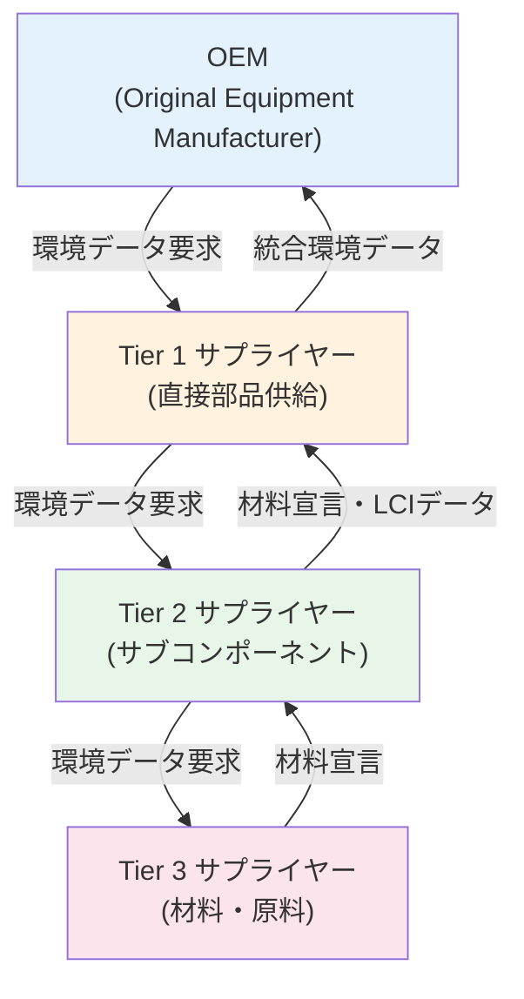

### 2.2 BOM/BOPの基礎

#### BOM（Bill of Materials：部品構成表）

BOMは製品を構成するすべての部品、材料、サブアセンブリのリストです。製造業において最も基本的かつ重要なデータ構造の1つです。

**BOMの種類**:

1. **EBOM (Engineering BOM)**: 設計BOM
   - 設計部門が作成
   - 製品の機能と構造に焦点
   - CAD/PLMシステムで管理

2. **MBOM (Manufacturing BOM)**: 製造BOM
   - 生産部門が作成
   - 製造プロセスに最適化
   - ERP/MESシステムで管理

3. **SBOM (Service BOM)**: サービスBOM
   - 保守・サービス部門が使用
   - 交換部品と保守手順

**BOMの階層構造**:

```
レベル 0: 最終製品 (Laptop Computer)
├─ レベル 1: ディスプレイアセンブリ
│  ├─ レベル 2: LCDパネル
│  ├─ レベル 2: バックライトユニット
│  └─ レベル 2: フレーム
├─ レベル 1: マザーボード
│  ├─ レベル 2: PCB基板
│  ├─ レベル 2: CPU
│  ├─ レベル 2: メモリ
│  └─ レベル 2: 各種IC
└─ レベル 1: バッテリー
   ├─ レベル 2: リチウムイオンセル
   └─ レベル 2: 保護回路
```

**環境LCA観点でのBOMの重要性**:

- **材料インベントリ**: 各材料の種類と質量を正確に把握
- **エンボディドエネルギー**: 材料ごとの製造エネルギーを積算
- **リサイクル性評価**: 材料の分離可能性とリサイクル率
- **有害物質管理**: 各部品の材料宣言との紐付け

#### BOP（Bill of Process：工程表）

BOPは製品を製造するために必要なすべての工程、作業、リソースのリストです。

**BOPに含まれる情報**:

- **工程ステップ**: 各製造工程の順序と内容
- **使用設備**: 工作機械、治具、工具
- **エネルギー消費**: 各工程での電力、燃料消費
- **プロセス材料**: 塗料、洗浄剤、潤滑油など
- **作業時間**: サイクルタイム、段取り時間
- **排出**: 大気、水、固形廃棄物

**LCA分析におけるBOPの役割**:

1. **プロセスエネルギー算定**
   - 各工程のエネルギー消費量を積算
   - 設備の稼働時間とエネルギー効率から計算

2. **プロセス排出の特定**
   - 加工・組立工程での直接排出
   - 化学処理工程での副生成物

3. **補助材料の把握**
   - 製品に残らない材料（切削油、洗浄剤など）
   - これらもLCI（Life Cycle Inventory）に含める必要

**BOMとBOPの統合**:

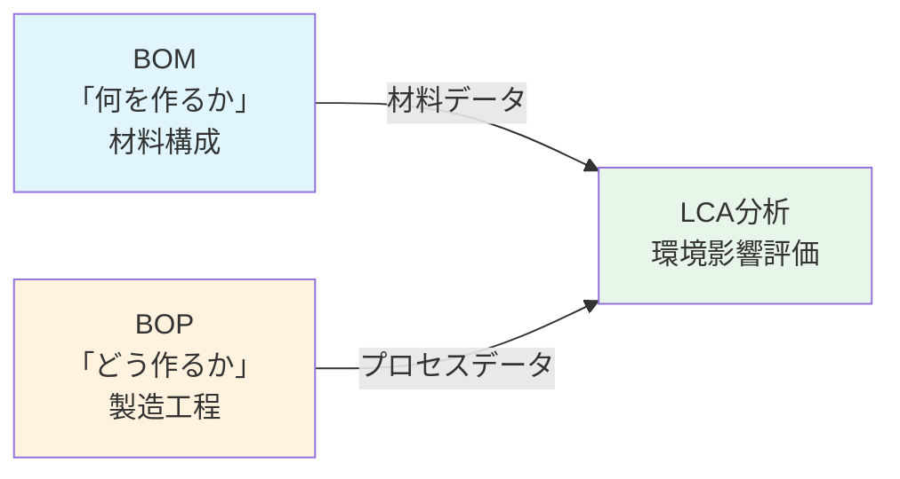

### 2.3 LCAの基本原則

#### LCAの定義と目的

LCA（Life Cycle Assessment：ライフサイクルアセスメント）は、製品やサービスのライフサイクル全体にわたる環境影響を定量的に評価する手法です。ISO 14040およびISO 14044で標準化されています。

**LCAの4つのフェーズ**（ISO 14040に基づく）:

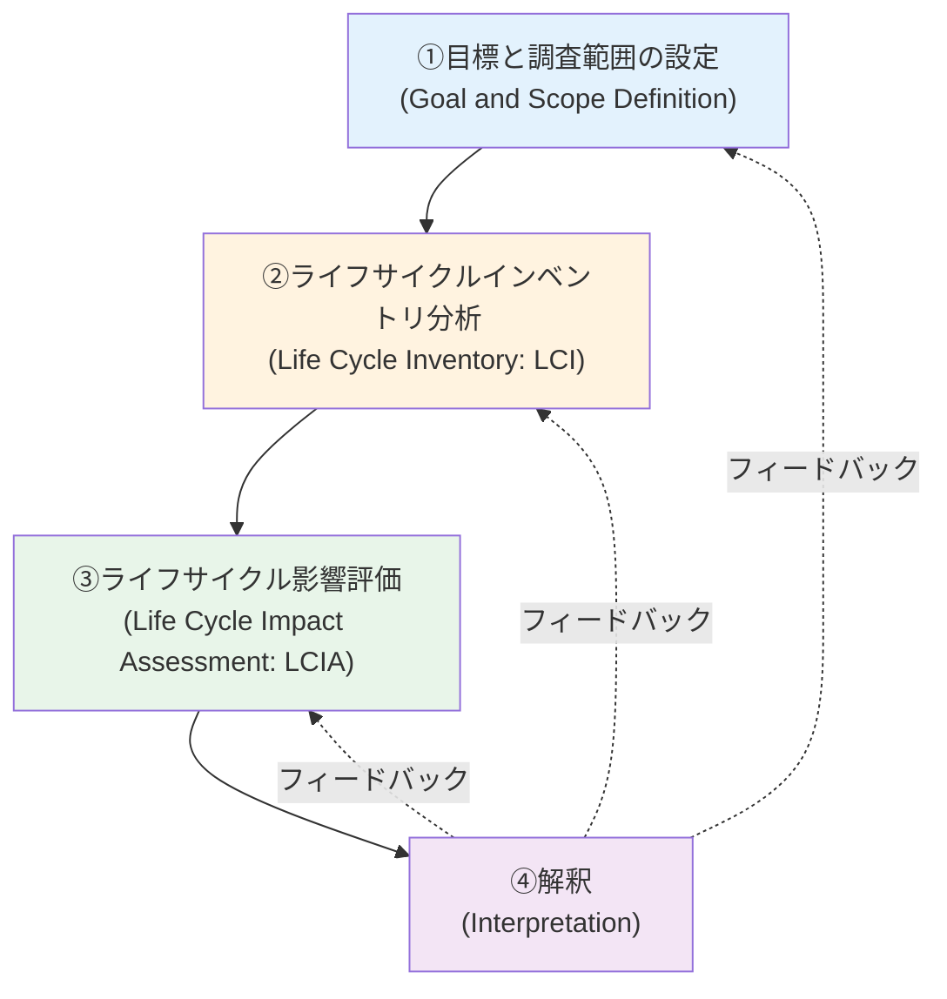

#### ① 目標と調査範囲の設定

- **機能単位（Functional Unit）の定義**
  - 例: "1台のラップトップPCを5年間使用する機能"
  - すべての環境影響はこの機能単位に対して計算される

- **システム境界の設定**
  - Cradle-to-Gate（ゆりかごからゲートまで）: 原材料採掘から製造工場出荷まで
  - Cradle-to-Grave（ゆりかごから墓場まで）: 廃棄・リサイクルまで含む
  - Gate-to-Gate: 特定の製造工程のみ

- **カットオフ基準**
  - 質量基準（例: 1%未満の材料は除外）
  - 環境影響基準（例: 総影響の5%未満は除外）

#### ② ライフサイクルインベントリ分析（LCI）

LCIは、製品のライフサイクル全体での投入（Input）と排出（Output）のデータを収集・計算するフェーズです。

**投入データ**:
- エネルギー（電力、化石燃料など）
- 原材料（金属、プラスチック、化学物質など）
- 水
- 土地利用

**排出データ**:
- 大気排出（CO2、NOx、SOx、VOCなど）
- 水系排出（重金属、有機物など）
- 土壌排出
- 固形廃棄物

**データ収集の課題**:
- 一次データ（Primary Data）: 実測値、実際の製造データ → 精度高いが収集困難
- 二次データ（Secondary Data）: LCIデータベース、文献値 → 入手容易だが一般性が高い

#### ③ ライフサイクル影響評価（LCIA）

LCIで収集したデータを環境影響カテゴリに変換します。

**主要な影響カテゴリ**:

| 影響カテゴリ | 単位 | 主要な寄与物質 |
|------------|------|---------------|
| 地球温暖化 | kg CO2-eq | CO2, CH4, N2O |
| オゾン層破壊 | kg CFC-11-eq | CFC, HCFC |
| 酸性化 | kg SO2-eq | SOx, NOx, NH3 |
| 富栄養化 | kg PO4-eq | NOx, P化合物 |
| 光化学オキシダント生成 | kg C2H4-eq | VOC, NOx |
| 資源枯渇 | kg Sb-eq | 希少金属 |
| 水消費 | m³ | 水 |
| 人間毒性 | CTUh | 有害化学物質 |
| 生態毒性 | CTUe | 生態系への有害物質 |

**LCIA手法の例**:
- **CML 2001**: オランダライデン大学開発、midpoint approach
- **ReCiPe**: CMLの後継、midpoint/endpoint両方
- **TRACI**: 米国EPA開発、北米向け
- **LIME**: 日本開発、endpoint approach

#### ④ 解釈

LCIとLCIAの結果を分析し、結論と推奨事項を導きます。

**解釈の要素**:
- **ホットスポット分析**: 最も影響が大きいライフサイクル段階や材料を特定
- **感度分析**: 仮定やデータの変化が結果に与える影響を評価
- **不確実性分析**: 結果の信頼性を定量化
- **改善機会の特定**: 環境負荷削減のための具体的提案

#### Attributional LCA vs Consequential LCA

**Attributional LCA（帰属型LCA）**:
- 現状の製品システムに帰属する環境負荷を算定
- 平均的なデータを使用
- EPD、カーボンフットプリント算定に使用

**Consequential LCA（結果型LCA）**:
- 製品システムの変化が引き起こす環境影響の変化を評価
- 限界的なデータを使用
- 政策決定、戦略的選択に使用

本レポートでは主にAttributional LCAを対象とします。

---

## 3. 主要標準とフォーマット

### 3.1 ILCD形式

#### 3.1.1 概要と目的

ILCD（International Reference Life Cycle Data System）は、欧州委員会の共同研究センター（JRC: Joint Research Centre）が2005年から開発しているLCAデータ交換のための包括的なシステムです。

**ILCDの主要コンポーネント**:

1. **ILCDハンドブック**: LCA実施のための技術ガイダンス
2. **ILCDデータフォーマット**: XMLベースのデータ交換フォーマット（本セクションの焦点）
3. **ILCDデータネットワーク**: 欧州のLCAデータベースを接続するネットワーク
4. **ELCD（European Life Cycle Database）**: 欧州参照LCIデータベース

**ILCD形式の目的**:

- LCAデータの**互換性**と**相互運用性**の向上
- データの**透明性**と**品質**の確保
- 異なるLCAツール間でのデータ交換の標準化
- ISO 14040/14044との整合性

**開発の歴史**:

- 2005年: 開発開始
- 2010年: ILCD Handbook第1版公開
- 2011年: ILCD Data Format Version 1.1公開
- 現在: ELCDデータベースと共に広く使用

#### 3.1.2 データ構造

ILCD形式はXMLベースで、スキーマ定義（XSD: XML Schema Definition）により厳密に構造化されています。

**基本的なXML構造**:

```xml
<?xml version="1.0" encoding="UTF-8"?>
<process xmlns="http://lca.jrc.it/ILCD/Process"
         xmlns:xsi="http://www.w3.org/2001/XMLSchema-instance"
         xsi:schemaLocation="..."
         version="1.1">

    <processInformation>
        <!-- プロセスの基本情報 -->
    </processInformation>

    <modellingAndValidation>
        <!-- モデリング手法と検証情報 -->
    </modellingAndValidation>

    <administrativeInformation>
        <!-- 管理情報（作成者、バージョンなど） -->
    </administrativeInformation>

    <exchanges>
        <!-- 入出力フロー -->
    </exchanges>

</process>
```

**UUID（Universally Unique Identifier）の使用**:

ILCDではすべてのデータセットに128ビットのUUIDを割り当てます。これにより、異なるデータベース間でのデータセットの一意な識別と参照が可能になります。

```xml
<UUID>12345678-90ab-cdef-1234-567890abcdef</UUID>
```

**多言語対応**:

ILCD形式はxml:lang属性を使用して多言語に対応しています：

```xml
<baseName xml:lang="en">Steel production</baseName>
<baseName xml:lang="de">Stahlproduktion</baseName>
<baseName xml:lang="ja">鉄鋼生産</baseName>
```

#### 3.1.3 8つのデータセットタイプ

ILCD形式は、LCAモデルを構成する異なる要素を表現するために、8種類のデータセットタイプを定義しています。

**1. Process Dataset（プロセスデータセット）**

最も重要なデータセットタイプで、単位プロセスまたは集約プロセスを表します。

- **内容**: 投入材料、エネルギー、排出物、製品出力
- **用途**: LCIモデルの基本構成要素
- **例**: "鉄鋼生産（高炉法）"、"電力発電（石炭火力）"

**主要要素**:
```xml
<processInformation>
    <dataSetInformation>
        <UUID/>
        <name/>
        <classificationInformation/>
        <generalComment/>
    </dataSetInformation>
    <quantitativeReference/>  <!-- 参照フロー -->
    <time/>                    <!-- 時間的代表性 -->
    <geography/>               <!-- 地理的代表性 -->
    <technology/>              <!-- 技術情報 -->
</processInformation>
<exchanges>                    <!-- 入出力フロー -->
    <exchange/>
    ...
</exchanges>
```

**2. Flow Dataset（フローデータセット）**

物質、材料、エネルギーのフローを表します。

- **3つのフロータイプ**:
  - **Elementary Flow**: 環境との交換（CO2排出、鉄鉱石採掘など）
  - **Product Flow**: 製品やサービス（鋼材、輸送サービスなど）
  - **Waste Flow**: 廃棄物

**例**:
```xml
<flowDataSet>
    <flowInformation>
        <dataSetInformation>
            <UUID>abc...</UUID>
            <name>
                <baseName xml:lang="en">Carbon dioxide</baseName>
            </name>
        </dataSetInformation>
        <quantitativeReference>
            <referenceToReferenceFlowProperty>0</referenceToReferenceFlowProperty>
        </quantitativeReference>
    </flowInformation>
    <flowProperties>
        <flowProperty>  <!-- 質量 -->
            <referenceToFlowPropertyDataSet type="flow property data set"
                refObjectId="...">
                <shortDescription>Mass</shortDescription>
            </referenceToFlowPropertyDataSet>
            <meanValue>1.0</meanValue>
        </flowProperty>
    </flowProperties>
</flowDataSet>
```

**3. Flow Property Dataset（フロー特性データセット）**

フローの測定可能な特性（質量、エネルギー、体積など）を定義します。

- **例**: 質量 [kg]、エネルギー [MJ]、体積 [m³]

**4. Unit Group Dataset（単位グループデータセット）**

測定単位とその変換係数を定義します。

**例**:
```xml
<unitGroupDataSet>
    <unitGroupInformation>
        <dataSetInformation>
            <name>
                <baseName xml:lang="en">Units of mass</baseName>
            </name>
        </dataSetInformation>
        <quantitativeReference>
            <referenceToReferenceUnit>0</referenceToReferenceUnit>  <!-- kg -->
        </quantitativeReference>
    </unitGroupInformation>
    <units>
        <unit dataSetInternalID="0">
            <name>kg</name>
            <meanValue>1.0</meanValue>  <!-- 基準単位 -->
        </unit>
        <unit dataSetInternalID="1">
            <name>g</name>
            <meanValue>0.001</meanValue>  <!-- 1g = 0.001kg -->
        </unit>
        <unit dataSetInternalID="2">
            <name>t</name>
            <meanValue>1000.0</meanValue>  <!-- 1t = 1000kg -->
        </unit>
    </units>
</unitGroupDataSet>
```

**5. LCIA Method Dataset（LCIA手法データセット）**

ライフサイクル影響評価の手法を定義します。

- **例**: CML 2001、ReCiPe、TRACI
- **内容**: 影響カテゴリ、特性化係数、正規化係数、重み付け係数

**6. Contact Dataset（連絡先データセット）**

データセットの作成者、レビュアー、出版者などの組織や個人の情報。

**7. Source Dataset（情報源データセット）**

データの出典（文献、レポート、データベースなど）の書誌情報。

**8. Life Cycle Model（ライフサイクルモデル）**

複数のプロセスデータセットを組み合わせた完全な製品システムモデル。

**データセット間の関係**:

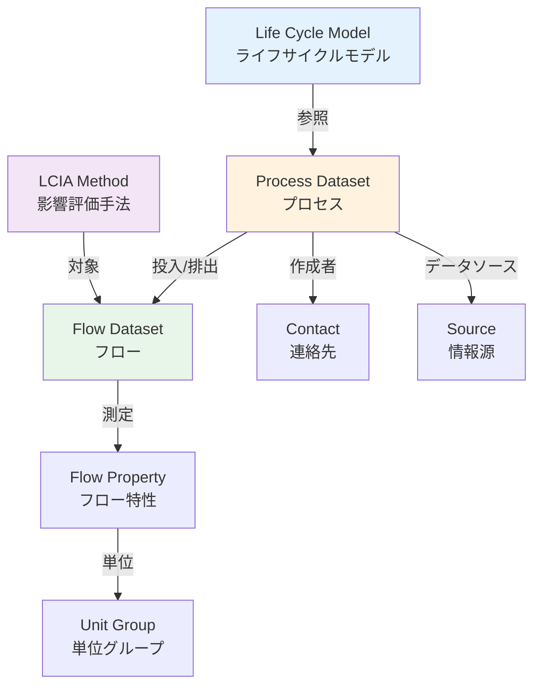

#### 3.1.4 ISO 14040/14044との関係

ILCD形式は、LCAの国際標準であるISO 14040およびISO 14044に完全準拠するよう設計されています。

**ISO 14040:2006** - Environmental management — Life cycle assessment — Principles and framework
- LCAの基本原則とフレームワークを定義
- 4つのLCAフェーズ（目標設定、LCI、LCIA、解釈）を規定

**ISO 14044:2006** - Environmental management — Life cycle assessment — Requirements and guidelines
- LCA実施の具体的要件とガイドラインを提供
- データ品質要件、レビュー手順、報告要件を規定

**ILCDがISO準拠を実現する方法**:

1. **データ品質指標**
   - ISO 14044で要求されるデータ品質項目（時間的・地理的・技術的代表性など）を全て含む
   - データ品質評価のためのPedigree Matrix対応

2. **システム境界と配分**
   - 多機能プロセスの配分手順をサポート
   - カットオフ基準の明確化

3. **レビューとドキュメント**
   - クリティカルレビューの記録
   - データソースと仮定の透明な記録

4. **柔軟性**
   - ISO標準の柔軟性を損なわない設計
   - 異なるLCA手法（Attributional/Consequential）に対応

**ILCDハンドブックの構成**:

ILCDハンドブックは、ISO標準を補完する詳細ガイダンスを提供：

- **General Guide**: LCAの一般的ガイダンス
- **Specific Guide for LCI**: LCIデータセット作成の詳細
- **Review Schemes**: レビュー手順
- **Nomenclature**: 命名規則
- **Data Format**: データフォーマット仕様

#### 3.1.5 ILCD形式の利点と制約

**利点**:

1. **包括性**: LCAに必要なすべてのデータタイプをカバー
2. **標準化**: 国際的に認められた標準、ISO準拠
3. **相互運用性**: 主要LCAツールがサポート
4. **品質保証**: データ品質指標とレビュー記録の組み込み
5. **柔軟性**: 様々なLCA手法論に対応
6. **透明性**: メタデータとドキュメントの徹底

**制約**:

1. **複雑性**: 完全な実装には専門知識が必要
2. **ファイルサイズ**: 詳細なメタデータによりファイルサイズが大きい
3. **学習曲線**: XML構造の理解が必要
4. **ツール依存**: 実際にはツールを介した利用が一般的
5. **バージョン管理**: データセットの更新管理が課題

### 3.2 ISO/IEC 82474

#### 3.2.1 標準の目的と適用範囲

**ISO/IEC 82474とは**

ISO/IEC 82474（旧IEC 62474）は、電気・電子製品およびそれらの部品の材料宣言に関する国際標準です。2025年にIECからISO/IECへと移管され、より広い産業分野への適用が期待されています。

**正式名称**:
- **IEC 82474-1:2025** - Material declaration — Part 1: General requirements
- （旧）IEC 62474:2018 - Material declaration for products of and for the electrotechnical industry

**標準の目的**:

1. **材料情報の標準化**: サプライチェーン全体での一貫した材料情報伝達
2. **規制コンプライアンス**: RoHS、REACH等の規制対応を効率化
3. **データ交換の効率化**: XMLベースの機械可読フォーマット
4. **透明性の向上**: 製品に含まれる物質の完全な可視化

**適用範囲**:

- **元々**: 電気・電子製品（EEE: Electrical and Electronic Equipment）
- **2025年版**: 他産業分野（自動車、医療機器、建設資材など）にも拡大

**カバーする情報**:

- 材料の名称と識別子（CAS番号等）
- 材料の質量または質量比
- 宣言可能物質（Declarable Substances）の有無と濃度
- 適用される規制と適合状況

#### 3.2.2 XMLスキーマ構造

ISO/IEC 82474はXMLベースのデータ交換フォーマットを規定しています。

**基本構造**:

```xml
<?xml version="1.0" encoding="UTF-8"?>
<MaterialDeclaration xmlns="http://std.iec.ch/iec82474"
                     version="3.0">

    <DeclarationInfo>
        <!-- 宣言の基本情報 -->
    </DeclarationInfo>

    <Product>
        <!-- 製品情報 -->
    </Product>

    <MaterialComposition>
        <!-- 材料構成 -->
    </MaterialComposition>

    <DeclarableSubstanceList>
        <!-- 宣言可能物質のチェック結果 -->
    </DeclarableSubstanceList>

    <ComplianceDeclaration>
        <!-- 適合宣言 -->
    </ComplianceDeclaration>

</MaterialDeclaration>
```

**主要要素の詳細**:

**1. DeclarationInfo（宣言情報）**

```xml
<DeclarationInfo>
    <DeclarationID>MD-2025-001234</DeclarationID>
    <DeclarationVersion>1.0</DeclarationVersion>
    <CreationDate>2025-10-25</CreationDate>
    <EffectiveDate>2025-10-25</EffectiveDate>
    <ExpirationDate>2026-10-25</ExpirationDate>

    <Declarant>
        <CompanyName>Example Corp.</CompanyName>
        <ContactPerson>
            <Name>John Doe</Name>
            <Email>john.doe@example.com</Email>
        </ContactPerson>
        <Address>...</Address>
    </Declarant>

    <RegulatoryRequirements>
        <Regulation>
            <Name>RoHS Directive 2011/65/EU</Name>
            <Status>Compliant</Status>
        </Regulation>
    </RegulatoryRequirements>
</DeclarationInfo>
```

**2. Product（製品情報）**

```xml
<Product>
    <ProductID>PCB-2025-REV-A</ProductID>
    <ProductName>Printed Circuit Board Assembly</ProductName>
    <ProductClassification>
        <ClassificationSystem>eCl@ss</ClassificationSystem>
        <ClassificationCode>27-02-30-01</ClassificationCode>
    </ProductClassification>
    <ProductMass unit="g">125.5</ProductMass>
    <Manufacturer>
        <CompanyName>Example Electronics</CompanyName>
        <CountryOfOrigin>JP</CountryOfOrigin>
    </Manufacturer>
</Product>
```

**3. MaterialComposition（材料構成）**

階層構造でコンポーネントと材料を記述：

```xml
<MaterialComposition>
    <Component>
        <ComponentID>COMP-001</ComponentID>
        <ComponentName>PCB Substrate</ComponentName>
        <ComponentMass unit="g">45.2</ComponentMass>
        <MassPercent>36.0</MassPercent>

        <Materials>
            <Material>
                <MaterialID>MAT-001</MaterialID>
                <MaterialName>Epoxy Resin</MaterialName>
                <CASNumber>25068-38-6</CASNumber>
                <MaterialMass unit="g">22.6</MaterialMass>
                <MassPercent>50.0</MassPercent>
                <MaterialCategory>Polymer</MaterialCategory>

                <DeclarableSubstances>
                    <SubstancePresent>false</SubstancePresent>
                </DeclarableSubstances>
            </Material>
            <!-- 他の材料 -->
        </Materials>
    </Component>
    <!-- 他のコンポーネント -->
</MaterialComposition>
```

**4. DeclarableSubstanceList（DSL）**

```xml
<DeclarableSubstanceList>
    <DSLReference>IEC 82474 DSL v25.0</DSLReference>
    <DSLDate>2025-01-01</DSLDate>

    <SubstanceEvaluation>
        <TotalSubstancesChecked>245</TotalSubstancesChecked>
        <SubstancesFound>0</SubstancesFound>
        <ThresholdLevel>0.1% (1000 ppm)</ThresholdLevel>
    </SubstanceEvaluation>

    <SpecificSubstanceCheck>
        <Substance>
            <Name>Lead (Pb)</Name>
            <CASNumber>7439-92-1</CASNumber>
            <Present>false</Present>
            <Concentration unit="ppm">0</Concentration>
            <RegulatoryLimit>1000 ppm (RoHS)</RegulatoryLimit>
        </Substance>
        <!-- 他の物質 -->
    </SpecificSubstanceCheck>
</DeclarableSubstanceList>
```

#### 3.2.3 材料宣言の要件

**必須情報**:

1. **宣言者情報**: 会社名、連絡先
2. **製品識別**: 製品ID、名称、質量
3. **材料リスト**: 各材料の名称、CAS番号、質量/質量比
4. **DSLチェック結果**: 宣言可能物質の有無
5. **規制適合状況**: RoHS、REACHなどへの適合性
6. **有効期限**: 宣言の有効期間

**データ品質要件**:

- **正確性**: ±5%以内の質量精度（一般的な業界慣行）
- **完全性**: すべての主要材料をカバー（一般的に質量の95%以上）
- **トレーサビリティ**: データソースの記録
- **検証**: 第三者試験結果（必要に応じて）

**階層レベル**:

材料宣言には3つのレベルがあります：

1. **Level A - 概要宣言**
   - 製品レベルの宣言可能物質の有無のみ
   - 詳細な材料構成なし
   - 最も簡易、精度は低い

2. **Level B - 部分的材料宣言**
   - 主要コンポーネントレベルの材料情報
   - DSLチェック結果を含む
   - 中程度の詳細さ

3. **Level C - 完全材料宣言** (Full Material Declaration: FMD)
   - すべてのコンポーネントと材料の完全なリスト
   - 質量またはホモジニアスマテリアルレベルの情報
   - 最も詳細、精度が高い

本レポートの例（`docs/examples/iso82474_sample.xml`）はLevel Cです。

#### 3.2.4 宣言可能物質リスト（DSL: Declarable Substance List）

**DSLとは**

IEC 82474標準の中核をなすのが、定期的に更新される宣言可能物質リスト（DSL）です。これは、規制対象または懸念される物質のリストで、製品に含まれる場合は宣言する必要があります。

**DSLの構造**:

DSLは以下の情報を含む物質のデータベースです：

| 項目 | 説明 |
|------|------|
| Substance ID | IEC 82474独自のID |
| Substance Name | 物質名（英語） |
| CAS Number | 化学物質登録番号 |
| EC Number | 欧州化学物質番号 |
| Reference | 関連する規制（RoHS、REACHなど） |
| Exemptions | 適用除外 |
| Threshold | 報告閾値 |

**DSLのカテゴリ**:

1. **Restricted Substances**: 使用制限物質
   - 例: RoHS 10物質（鉛、水銀、カドミウム、六価クロム、PBB、PBDE、DEHP、BBP、DBP、DIBP）

2. **Declarable Substances**: 宣言が必要な物質
   - 例: REACH SVHC（高懸念物質）
   - 例: ハロゲン系難燃剤

3. **Reportable Application**: 特定用途で報告が必要な物質

**DSLのバージョン管理**:

DSLは定期的に更新されます：
- 通常、年2回更新（1月と7月）
- 新規規制の追加
- 既存規制の改正反映
- バージョン番号で管理（例: v25.0）

**DSLチェックのプロセス**:

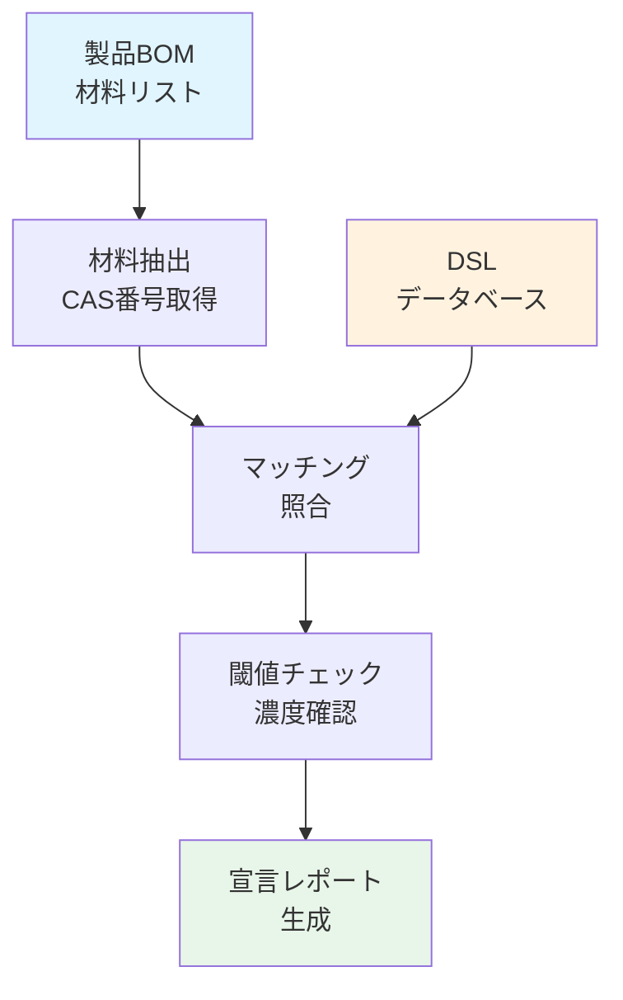

**閾値（Threshold）**:

多くの規制は閾値を設定しています：

- **RoHS**: 均質材料中1000 ppm（0.1重量%）、カドミウムは100 ppm
- **REACH SVHC**: 成形品中0.1重量%超で届出義務
- **その他**: 物質や規制により異なる

**DSLチェックツール**:

多くのソフトウェアツールがDSLチェックを自動化：
- IPC-1752A準拠ツール
- BOMcheckツール
- サプライヤー管理システム統合

#### 3.2.5 IEC 82474からISO/IEC 82474への移行

**2025年版の主要な変更点**:

1. **適用範囲の拡大**
   - 電気電子以外の産業セクターも対象
   - 材料効率と循環経済への対応強化

2. **Webサービス対応** (新Clause 8)
   - Machine-to-Machine通信のサポート
   - RESTful API仕様
   - 認証サービスの標準化
   - JSONデータ表現の追加（XMLに加えて）

3. **プロセスケミカル宣言** (新Subclause 4.6)
   - 製造プロセスで使用される化学物質の宣言
   - ライフサイクルフェーズごとのプロセス化学物質情報

4. **定義の明確化**
   - 他産業セクターのニーズを反映
   - より汎用的な用語定義

5. **新しいレファレンスリストタイプ**
   - 循環経済関連の物質リスト
   - リサイクル含有率の宣言

**移行の影響**:

- 既存のIEC 62474データは引き続き有効
- XMLスキーマは後方互換性を維持
- ツールベンダーは段階的に新バージョンへ対応
- 新機能（Webサービスなど）はオプション

---

*（レポートは次のセクションに続きます）*

## 4. データ連携のフロー

### 4.1 BOM/BOPからのデータ抽出

#### データソースの特定

製品のライフサイクル環境情報を収集するための第一歩は、既存のBOM/BOPシステムからデータを抽出することです。

**主要なデータソース**:

| システム | 提供するデータ | 環境LCAへの関連性 |
|---------|--------------|------------------|
| PLM (Product Lifecycle Management) | EBOM、CADデータ、製品仕様 | 材料構成、製品質量 |
| ERP (Enterprise Resource Planning) | MBOM、調達データ、サプライヤー情報 | コスト、サプライヤー、材料ソース |
| MES (Manufacturing Execution System) | BOP、工程データ、実績データ | エネルギー消費、プロセス排出 |
| PDM (Product Data Management) | 設計変更履歴、部品マスタ | 材料仕様、バージョン管理 |
| SCM (Supply Chain Management) | 輸送データ、在庫データ | 輸送距離、物流排出 |

**データ抽出の課題**:

1. **データ分散**: 必要な情報が複数のシステムに分散
2. **フォーマット不統一**: 各システムで異なるデータ構造
3. **データ品質**: 不完全または古いデータ
4. **アクセス権限**: システム間のデータ統合の障壁
5. **リアルタイム性**: データ更新のタイミング

#### BOMデータの環境情報への変換

標準的なBOMから環境LCAに必要な情報への変換プロセス:

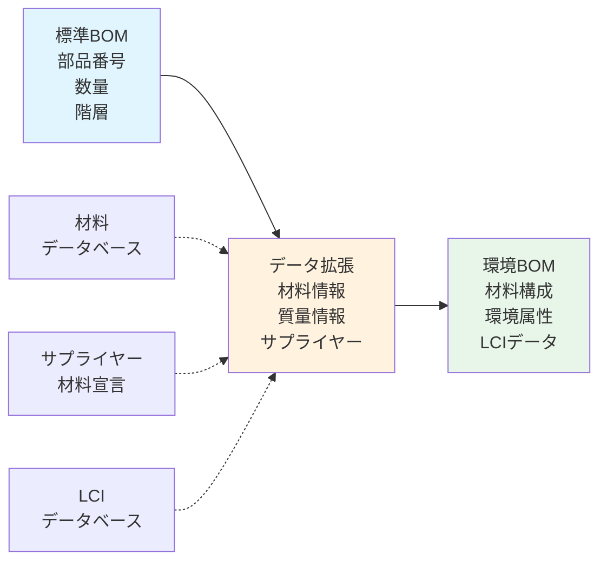

**必要な拡張情報**:

1. **材料情報**
   - 材料名（標準化された名称）
   - 材料タイプ（金属、プラスチック、複合材など）
   - CAS番号（Chemical Abstracts Service番号）
   - 質量または質量比

2. **製造情報**
   - 製造工程タイプ
   - 製造地域
   - エネルギー源

3. **サプライヤー情報**
   - サプライヤー名と所在地
   - 材料宣言書の参照
   - 認証情報（ISO 14001など）

4. **環境属性**
   - リサイクル含有率
   - エンボディドカーボン
   - リサイクル可能性

#### BOPデータの環境情報への変換

製造工程（BOP）から環境影響データへの変換:

**工程ごとのデータ収集**:

```
工程名: CNC加工
├─ 投入
│  ├─ 材料: アルミニウムブロック 1.0 kg
│  ├─ 電力: 2.5 kWh
│  ├─ 切削油: 0.05 L
│  └─ 冷却水: 10 L
├─ 産出
│  ├─ 製品: 加工部品 0.75 kg
│  └─ 廃棄物: アルミ切粉 0.25 kg (リサイクル可)
├─ 排出
│  ├─ CO2 (電力由来): 1.25 kg (電力排出係数: 0.5 kg-CO2/kWh)
│  └─ 廃液: 使用済み切削油 0.05 L
└─ 時間
   ├─ サイクルタイム: 15分
   └─ 設備稼働率: 70%
```

**プロセスエネルギーの算定**:

$$E_{process} = \sum_{i=1}^{n} (P_i \times t_i \times u_i)$$

where:
- $E_{process}$: 総プロセスエネルギー
- $P_i$: 設備iの定格電力
- $t_i$: 設備iの稼働時間
- $u_i$: 設備iの負荷率

#### データ品質の確保

**データ品質指標** (ISO 14044準拠):

| 指標 | 評価項目 | 評価方法 |
|------|---------|---------|
| 時間的代表性 | データの年度 | 5段階評価（最新〜10年以上前） |
| 地理的代表性 | データの地域 | 実際の製造地との一致度 |
| 技術的代表性 | 製造技術 | 実際の技術との一致度 |
| 完全性 | データのカバー率 | 質量ベース％ |
| 精度 | 測定精度 | 推定値 vs 実測値 |
| 整合性 | 方法論の一貫性 | LCA手法の統一性 |

**Pedigree Matrix**: データ品質を定量化する手法

各指標を1〜5でスコアリング:
- 1: 非常に良い（実測値、最新、特定技術）
- 3: 普通（計算値、5年以内、業界平均）
- 5: 悪い（推定値、10年以上前、非代表的）

### 4.2 ISO/IEC 82474による材料宣言

#### 材料宣言の生成プロセス

BOMデータからISO/IEC 82474準拠の材料宣言を生成する手順:

**ステップ1: 材料情報の収集**

```
製品: ノートパソコン
└─ コンポーネント1: ディスプレイモジュール
   ├─ 材料A: LCDガラス (質量: 158g, 45%)
   ├─ 材料B: ABSプラスチック (質量: 105g, 30%)
   ├─ 材料C: 電子部品 (質量: 53g, 15%)
   └─ 材料D: アルミフレーム (質量: 35g, 10%)
```

**ステップ2: 材料のCAS番号特定**

各材料について化学物質データベースを参照:

- LCDガラス → 複合材料（主成分: SiO2, ケイ酸ナトリウム等）
- ABSプラスチック → CAS 9003-56-9
- アルミニウム合金 → 合金組成を記載

**ステップ3: DSL（宣言可能物質リスト）チェック**

IEC 82474 DSLと照合:

```python
# 疑似コード
def check_dsl(material_composition, dsl_database):
    results = []
    for material in material_composition:
        for substance in material.substances:
            if substance.cas_number in dsl_database:
                threshold = dsl_database[substance.cas_number].threshold
                if substance.concentration > threshold:
                    results.append({
                        'substance': substance.name,
                        'cas': substance.cas_number,
                        'concentration': substance.concentration,
                        'regulation': dsl_database[substance.cas_number].regulation,
                        'status': 'PRESENT_ABOVE_THRESHOLD'
                    })
    return results
```

**ステップ4: XML生成**

ISO/IEC 82474 XMLスキーマに従ってXMLファイルを生成（`docs/examples/iso82474_sample.xml`参照）。

#### サプライヤーからの材料宣言収集

**サプライヤーへの要求**:

典型的なサプライヤー要求プロセス:

1. **初期要求**: 購買契約時に材料宣言提供を条件化
2. **テンプレート提供**: ISO/IEC 82474準拠のテンプレートまたはツール
3. **期限設定**: 通常30-90日
4. **検証**: 受領した宣言の妥当性チェック
5. **更新**: 定期的な更新（年1回または製品変更時）

**IPC-1752準拠**:

電子産業では、IPC-1752標準も広く使用されています:
- IPC-1752A: 材料宣言の標準フォーマット
- Class A: 宣言可能物質の存在のみ
- Class B: 宣言可能物質の濃度レベル
- Class C: 完全な材料構成（FMD）
- Class D: 完全な材料構成 + 物質濃度

ISO/IEC 82474とIPC-1752は相互に変換可能なマッピングが存在します。

#### 規制コンプライアンスの検証

**主要規制との照合**:

**1. RoHS (Restriction of Hazardous Substances)**

制限物質（10物質）:
- 鉛 (Pb): 1000 ppm
- 水銀 (Hg): 1000 ppm
- カドミウム (Cd): 100 ppm
- 六価クロム (Cr VI): 1000 ppm
- PBB (ポリ臭化ビフェニル): 1000 ppm
- PBDE (ポリ臭化ジフェニルエーテル): 1000 ppm
- DEHP, BBP, DBP, DIBP (フタル酸エステル): 各1000 ppm

**2. REACH (Registration, Evaluation, Authorization of Chemicals)**

- SVHC (Substance of Very High Concern) リスト: 定期更新
- 成形品中0.1重量%超で届出義務
- 現在240物質以上がSVHCに指定

**3. その他の規制**

- 中国RoHS (GB/T 26572)
- カリフォルニア州Proposition 65
- 紛争鉱物規制 (Dodd-Frank Act)

**コンプライアンス判定**:

```
製品: PCBアセンブリ
├─ RoHS適合性: ✓ 適合
│  └─ すべての制限物質が閾値未満
├─ REACH適合性: ✓ 適合
│  └─ SVHCは0.1重量%未満
└─ 全体判定: 適合
   └─ 材料宣言に記載
```

### 4.3 ILCD形式への変換

#### データマッピングの原則

ISO/IEC 82474材料宣言からILCD形式への変換は、以下の原則に基づきます:

**マッピングテーブル**:

| ISO/IEC 82474 | ILCD形式 | マッピング方法 |
|---------------|----------|---------------|
| Product | Process Dataset | 製品 = 参照フローを持つプロセス |
| Material | Flow Dataset (Product Flow) | 材料 = 製品フロー |
| Component | Process Dataset (中間) | コンポーネント = サブプロセス |
| MaterialMass | Exchange.meanAmount | 質量 = フロー量 |
| CASNumber | Flow.CASNumber | 直接マッピング |
| Substance (DSL) | Flow Dataset (Elementary Flow) | 排出物質 = 基本フロー |

#### 変換プロセスの詳細

**ステップ1: 製品をProcessデータセットに変換**

ISO/IEC 82474の`<Product>`要素:
```xml
<Product>
    <ProductID>PCB-2025-REV-A</ProductID>
    <ProductName>Printed Circuit Board Assembly</ProductName>
    <ProductMass unit="g">125.5</ProductMass>
</Product>
```

↓ 変換 ↓

ILCDのProcessデータセット:
```xml
<process>
    <processInformation>
        <dataSetInformation>
            <UUID>generated-uuid</UUID>
            <name>
                <baseName xml:lang="en">Printed Circuit Board Assembly</baseName>
            </name>
        </dataSetInformation>
        <quantitativeReference>
            <referenceToReferenceFlow>0</referenceToReferenceFlow>
        </quantitativeReference>
    </processInformation>
    <exchanges>
        <exchange dataSetInternalID="0">
            <!-- 参照フロー: PCB 125.5g -->
            <meanAmount>0.1255</meanAmount>  <!-- kg単位 -->
        </exchange>
    </exchanges>
</process>
```

**ステップ2: 材料をFlowデータセットに変換**

ISO/IEC 82474の`<Material>`:
```xml
<Material>
    <MaterialName>Copper</MaterialName>
    <CASNumber>7440-50-8</CASNumber>
    <MaterialMass unit="g">32.8</MaterialMass>
</Material>
```

↓ 変換 ↓

ILCDのFlowデータセット + Exchangeエントリ:
```xml
<!-- Flow定義 -->
<flowDataSet>
    <flowInformation>
        <dataSetInformation>
            <UUID>copper-flow-uuid</UUID>
            <name>
                <baseName xml:lang="en">Copper</baseName>
            </name>
            <CASNumber>7440-50-8</CASNumber>
        </dataSetInformation>
    </flowInformation>
    <flowProperties>
        <flowProperty>
            <referenceToFlowPropertyDataSet>
                <shortDescription>Mass</shortDescription>
            </referenceToFlowPropertyDataSet>
        </flowProperty>
    </flowProperties>
</flowDataSet>

<!-- Processでの使用 -->
<exchange dataSetInternalID="1">
    <referenceToFlowDataSet refObjectId="copper-flow-uuid">
        <shortDescription>Copper</shortDescription>
    </referenceToFlowDataSet>
    <meanAmount>0.0328</meanAmount>  <!-- kg -->
</exchange>
```

**ステップ3: 環境排出データの追加**

材料宣言には含まれていないが、LCAに必要な情報を補完:

- **エネルギー投入**: LCIデータベースから材料ごとのエンボディドエネルギー
- **排出データ**: 材料生産時の環境排出（CO2など）
- **輸送**: サプライヤーから工場までの輸送距離と手段

```xml
<!-- エネルギー投入 -->
<exchange dataSetInternalID="2">
    <referenceToFlowDataSet>
        <shortDescription>Electricity</shortDescription>
    </referenceToFlowDataSet>
    <meanAmount>0.45</meanAmount>  <!-- kWh -->
</exchange>

<!-- CO2排出 -->
<exchange dataSetInternalID="3">
    <referenceToFlowDataSet>
        <shortDescription>Carbon dioxide</shortDescription>
    </referenceToFlowDataSet>
    <meanAmount>1.85</meanAmount>  <!-- kg -->
    <outputGroup>4</outputGroup>  <!-- 大気への排出 -->
</exchange>
```

#### 自動変換ツールの活用

**既存の変換ツール**:

1. **openLCA Format Converter**
   - 複数のLCAフォーマット間の変換
   - コマンドライン/GUI両対応
   - オープンソース

2. **カスタムスクリプト**
   - Python + XMLライブラリ（lxml, elementTree）
   - XSLT（XSL Transformations）
   - 企業独自のマッピングルール実装

**変換時の注意点**:

- **データ損失**: ISO/IEC 82474にあってILCDにない情報（規制適合性など）
- **データ補完**: ILCDに必要だがISO/IEC 82474にない情報（プロセスエネルギーなど）
- **単位変換**: g → kg, ppm → kg/kgなど
- **UUID生成**: 新規データセットに一意のUUIDを割り当て
- **参照整合性**: フローとプロセス間の参照が正しいこと

### 4.4 LCAツールでの分析

#### ILCD形式のインポート

主要なLCAツールはすべてILCD形式のインポートに対応しています。

**openLCA**:

```
1. [File] → [Import] → [Linked Data (ILCD)] を選択
2. ILCDファイルまたはzipアーカイブを選択
3. インポートオプション設定:
   - Update existing datasets
   - Create new datasets
4. [Finish] でインポート実行
```

インポート後:
- Processデータセットが「Processes」フォルダに追加
- Flowデータセットが「Flows」フォルダに追加
- 自動的に参照関係が解決される

**SimaPro**:

SimaProは直接ILCDをインポートできませんが、変換ツールを使用:

```
1. openLCA Format Converterを使用
2. ILCD → SimaPro CSV形式に変換
3. SimaProで [File] → [Import] → [CSV file]
```

または、openLCAを中間ステップとして使用:
```
ILCD → openLCA → Export as SimaPro CSV → SimaPro
```

**GaBi/Sphera**:

```
1. [Database] → [Import] → [ILCD format]
2. ファイル選択とマッピング設定
3. インポート実行
```

#### LCI（ライフサイクルインベントリ）モデルの構築

インポートしたデータを使ってLCIモデルを構築:

**製品システムの定義**:

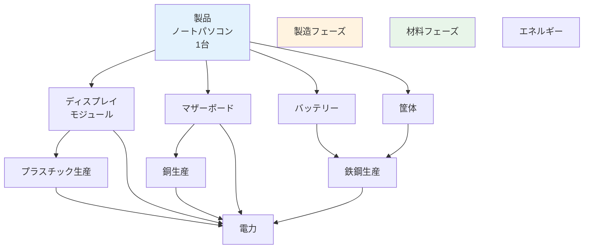

**フォアグラウンドデータとバックグラウンドデータ**:

- **フォアグラウンド**: 製品固有のデータ（自社のBOM/BOP、材料宣言）
- **バックグラウンド**: 汎用的なデータ（LCIデータベースの材料生産プロセス）

ILCD形式でインポートしたBOM由来のデータはフォアグラウンドデータとして扱い、不足する上流プロセス（材料生産、エネルギー生産など）はLCIデータベース（ELCD、ecoinventなど）で補完します。

#### LCIA（ライフサイクル影響評価）の実行

LCIモデルが完成したら、影響評価を実行:

**1. 影響評価手法の選択**

例: ReCiPe 2016 Midpoint (H)

影響カテゴリ:
- Global warming (kg CO2-eq)
- Ozone depletion (kg CFC-11-eq)
- Terrestrial acidification (kg SO2-eq)
- Freshwater eutrophication (kg P-eq)
- Marine eutrophication (kg N-eq)
- Human toxicity (kg 1,4-DB-eq)
- Photochemical oxidant formation (kg NMVOC-eq)
- Terrestrial ecotoxicity (kg 1,4-DB-eq)
- Freshwater ecotoxicity (kg 1,4-DB-eq)
- Marine ecotoxicity (kg 1,4-DB-eq)
- Agricultural land occupation (m²a)
- Urban land occupation (m²a)
- Natural land transformation (m²)
- Water depletion (m³)
- Metal depletion (kg Fe-eq)
- Fossil depletion (kg oil-eq)

**2. 計算の実行**

openLCAでの例:
```
1. Product Systemを選択
2. 右クリック → [Calculate]
3. Impact assessment method: ReCiPe 2016 Midpoint (H)
4. Allocation method: None (single output)
5. [Finish] で計算実行
```

**3. 結果の分析**

計算結果の表示形式:
- **Inventory Results**: フローごとの集計
- **Impact Assessment Results**: 影響カテゴリごとの結果
- **Contribution Analysis**: ホットスポット特定
- **Sankey Diagram**: フローの可視化
- **Comparison**: 複数シナリオの比較

**結果の例**（ノートパソコン1台の製造段階）:

| 影響カテゴリ | 値 | 単位 | 主要寄与プロセス |
|------------|-----|------|----------------|
| 地球温暖化 | 74.1 | kg CO2-eq | マザーボード製造(30%)、バッテリー(25%) |
| 資源枯渇（鉱物） | 2.85 | kg Cu-eq | マザーボード（希少金属） |
| 資源枯渇（化石） | 285 | MJ | プラスチック材料、電力 |

#### 感度分析と不確実性評価

**感度分析**: 主要パラメータの変動が結果に与える影響を評価

例:
- バッテリー容量を50Whから65Whに変更 → 地球温暖化影響+12%
- リサイクルアルミ使用率を50%から70%に変更 → 資源枯渇-15%

**不確実性分析**: データの不確実性が結果に与える影響

- モンテカルロシミュレーション（1000回の計算）
- 結果の95%信頼区間を算出
- 例: 地球温暖化 = 74.1 ± 8.3 kg CO2-eq (95% CI)

---

## 5. ILCD形式とISO/IEC 82474の関係性

### 5.1 相互補完的な役割

ILCD形式とISO/IEC 82474は、異なる目的を持ちながら、サプライチェーン環境情報管理において相互補完的な役割を果たします。

#### それぞれの主要な焦点

**ISO/IEC 82474の焦点**:
- ✓ 材料の化学組成
- ✓ 規制物質の特定と濃度
- ✓ コンプライアンス検証（RoHS、REACHなど）
- ✓ 製品の「何でできているか」
- ✓ サプライチェーン間の材料情報伝達

**ILCD形式の焦点**:
- ✓ ライフサイクル全体の環境影響
- ✓ エネルギーと物質のフロー
- ✓ 製造プロセスと排出
- ✓ 製品の「環境影響はどれくらいか」
- ✓ LCAデータベース間のデータ交換

#### 統合による価値

両者を統合することで実現できること:

**1. 包括的な環境プロファイル**
```
ISO/IEC 82474     +     ILCD形式      =   完全な環境プロファイル
────────────────────────────────────────────────────────────
材料構成情報            プロセス情報         規制適合性
化学物質データ          環境排出データ    +  環境影響評価
質量データ              エネルギーデータ     トレーサビリティ
```

**2. 規制と持続可能性の両立**

企業は以下の両方に対応する必要があります:
- 規制コンプライアンス（ISO/IEC 82474で対応）
- サステナビリティ目標（ILCD/LCAで対応）

統合アプローチにより、一度のデータ収集で両方の要求に対応可能。

**3. データ収集の効率化**

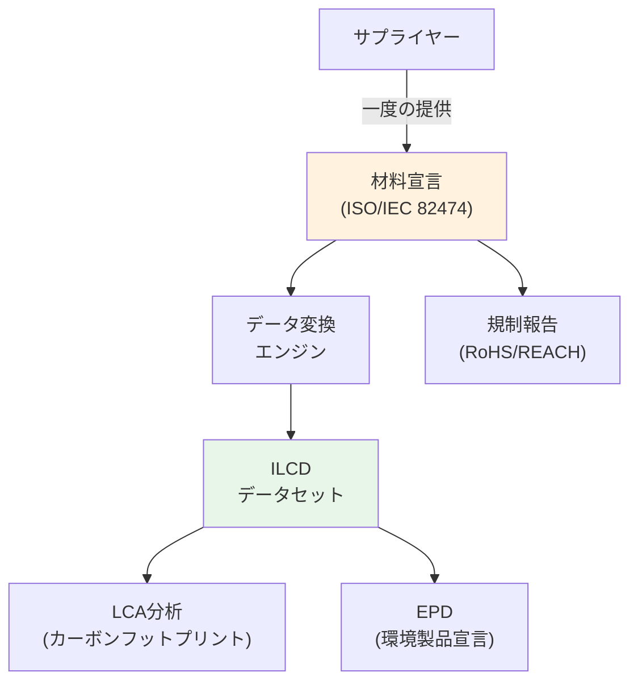

### 5.2 データマッピング

ISO/IEC 82474とILCD形式間の詳細なデータマッピング関係を示します。

#### 詳細マッピングテーブル

| # | ISO/IEC 82474要素 | ILCD要素 | マッピングルール | データタイプ |
|---|------------------|----------|----------------|-------------|
| 1 | Product/ProductID | Process/UUID | 新規UUID生成 | String(UUID) |
| 2 | Product/ProductName | Process/name/baseName | 直接コピー | String |
| 3 | Product/ProductMass | Exchange/meanAmount | 単位変換(g→kg) | Double |
| 4 | Component/ComponentName | Process/name | コンポーネント=サブプロセス | String |
| 5 | Material/MaterialName | Flow/name/baseName | 材料=製品フロー | String |
| 6 | Material/CASNumber | Flow/CASNumber | 直接コピー | String |
| 7 | Material/MaterialMass | Exchange/meanAmount | 単位変換 | Double |
| 8 | Material/MaterialCategory | Flow/classificationInformation | カテゴリマッピング | Enum |
| 9 | DeclarableSubstances | Flow (Elementary) | 物質=基本フロー | Complex |
| 10 | RegulatoryRequirements | administrativeInformation/compliance | テキスト情報 | String |
| 11 | Declarant | administrativeInformation/dataEntryBy | 連絡先情報 | Contact |
| 12 | CreationDate | administrativeInformation/dataEntryBy/timeStamp | ISO日付形式 | DateTime |

#### マッピングの具体例

**例1: 製品レベルのマッピング**

ISO/IEC 82474:
```xml
<Product>
    <ProductID>PCB-2025-REV-A</ProductID>
    <ProductName>Printed Circuit Board Assembly</ProductName>
    <ProductMass unit="g">125.5</ProductMass>
    <Manufacturer>
        <CompanyName>Example Electronics</CompanyName>
        <CountryOfOrigin>JP</CountryOfOrigin>
    </Manufacturer>
</Product>
```

↓ マッピング ↓

ILCD:
```xml
<process>
    <processInformation>
        <dataSetInformation>
            <UUID>generated-12345678-90ab-cdef-1234-567890abcdef</UUID>
            <name>
                <baseName xml:lang="en">Printed Circuit Board Assembly; production</baseName>
            </name>
        </dataSetInformation>
        <geography>
            <locationOfOperationSupplyOrProduction location="JP"/>
        </geography>
    </processInformation>
    <exchanges>
        <exchange dataSetInternalID="0">
            <referenceToFlowDataSet>
                <shortDescription>Printed Circuit Board Assembly</shortDescription>
            </referenceToFlowDataSet>
            <meanAmount>0.1255</meanAmount>  <!-- 125.5g = 0.1255kg -->
            <resultingAmount>0.1255</resultingAmount>
        </exchange>
    </exchanges>
</process>
```

**例2: 材料レベルのマッピング**

ISO/IEC 82474:
```xml
<Material>
    <MaterialID>MAT-003</MaterialID>
    <MaterialName>Copper</MaterialName>
    <CASNumber>7440-50-8</CASNumber>
    <MaterialMass unit="g">32.8</MaterialMass>
    <MassPercent>26.1</MassPercent>
    <MaterialCategory>Metal</MaterialCategory>
</Material>
```

↓ マッピング ↓

ILCD Flow + Exchange:
```xml
<!-- Flowデータセット -->
<flowDataSet>
    <flowInformation>
        <dataSetInformation>
            <UUID>flow-copper-uuid</UUID>
            <name>
                <baseName xml:lang="en">Copper</baseName>
            </name>
            <CASNumber>7440-50-8</CASNumber>
            <classificationInformation>
                <classification name="ILCD">
                    <class level="0">Materials production</class>
                    <class level="1">Metals and semimetals</class>
                    <class level="2">Copper</class>
                </classification>
            </classificationInformation>
        </dataSetInformation>
    </flowInformation>
</flowDataSet>

<!-- Process内のExchange -->
<exchange dataSetInternalID="2">
    <referenceToFlowDataSet refObjectId="flow-copper-uuid">
        <shortDescription>Copper</shortDescription>
    </referenceToFlowDataSet>
    <meanAmount>0.0328</meanAmount>  <!-- 32.8g = 0.0328kg -->
    <inputGroup>5</inputGroup>  <!-- From technosphere -->
</exchange>
```

#### 変換時のデータ補完

ISO/IEC 82474にはないが、ILCD形式で必要な情報の補完方法:

**1. プロセスエネルギー**

材料宣言には製造エネルギーが含まれないため、LCIデータベースから補完:

```python
# 疑似コード
def add_energy_data(material, lci_database):
    # 材料名からLCIデータを検索
    lci_process = lci_database.find(material.name, material.cas_number)
    
    if lci_process:
        # エネルギー投入を追加
        energy_input = lci_process.energy_per_kg * material.mass_kg
        return energy_input
    else:
        # デフォルト値または推定値を使用
        return estimate_energy(material.category)
```

**2. 環境排出**

製造プロセスの排出データを追加:

```
材料: 鋼材 1kg
└─ LCIデータベース参照: "Steel production, primary, BOF"
   ├─ CO2排出: 1.85 kg
   ├─ SO2排出: 0.0025 kg
   └─ NOx排出: 0.0018 kg
```

**3. 輸送**

サプライヤーからの輸送を追加:

```
輸送距離: 500 km (トラック)
└─ LCIプロセス: "Transport, freight, lorry >16t"
   ├─ ディーゼル消費: 計算
   └─ CO2排出: 計算
```

### 5.3 統合の課題

#### 技術的課題

**1. データ粒度の不一致**

ISO/IEC 82474:
- コンポーネントレベルまたはホモジニアスマテリアルレベル
- 非常に詳細（数百〜数千の材料エントリ）

ILCD:
- プロセスレベル
- 通常は集約されたデータ

課題: 詳細すぎる材料宣言を適切に集約する必要

**2. 命名規則の違い**

同じ材料でも異なる名称:
- ISO/IEC 82474: "ABS Resin"
- ILCD Flow: "Acrylonitrile-butadiene-styrene copolymer"
- LCIデータベース: "Plastics, ABS, at plant"

解決策: 材料名称辞書とCAS番号による照合

**3. システム境界の定義**

材料宣言: 製品の物理的境界
LCA: ライフサイクル全体の境界

統合時に境界を明確に定義する必要

**4. データ品質の不均一性**

- サプライヤーからの材料宣言: 品質がばらつく
- LCIデータベース: 標準化されているが一般的
- 統合時にデータ品質を評価・記録する必要

#### 組織的課題

**1. 部門間の連携**

| 部門 | 関与するデータ | 課題 |
|------|--------------|------|
| 調達 | ISO/IEC 82474材料宣言の収集 | サプライヤー管理 |
| 環境/サステナビリティ | LCA実施、ILCD データ | 専門知識 |
| 製品設計 | BOM作成 | 環境データ統合 |
| 品質保証 | データ検証 | 検証基準 |
| IT | システム統合 | ツール実装 |

課題: 部門横断的な協力体制の構築

**2. データオーナーシップとアクセス権**

- 誰がデータを管理するか
- 誰がデータにアクセスできるか
- データ更新の責任は誰にあるか

**3. サプライヤーとの関係**

- サプライヤーへの要求レベル設定
- 小規模サプライヤーへの支援
- データ品質のインセンティブ

#### データプライバシーと機密保護

**課題**:

1. **企業機密**: BOMは製品の核心情報
2. **サプライヤー情報**: サプライヤー名や調達価格は機密
3. **技術情報**: 製造プロセスの詳細は競争力の源泉

**解決策**:

- **データ集約**: 詳細を隠して集約データのみ公開
- **匿名化**: サプライヤー名を匿名化
- **アクセス制御**: 役割ベースのアクセス管理
- **セキュアなデータ交換**: 暗号化、VPN、ブロックチェーン

### 5.4 解決策とベストプラクティス

#### 技術的解決策

**1. 統合データプラットフォーム**

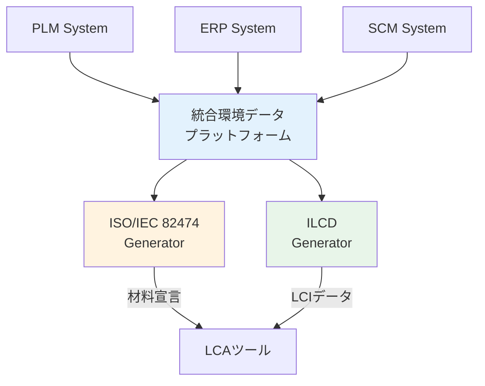

利点:
- 単一のデータソース（Single Source of Truth）
- データ整合性の確保
- 自動化されたデータフロー

**2. マテリアルマスタデータベース**

すべての材料情報を集中管理:

```
Material Master Database
├─ Material ID: M-12345
├─ Material Name: "Copper, electrolytic"
├─ CAS Number: 7440-50-8
├─ Category: Metal
├─ Properties
│  ├─ Density: 8.96 g/cm³
│  ├─ Melting Point: 1084°C
│  └─ ...
├─ Environmental Data
│  ├─ Embodied Energy: 45 MJ/kg
│  ├─ Embodied Carbon: 3.2 kg CO2/kg
│  └─ Recyclability: 100%
├─ Regulatory Data
│  ├─ RoHS: Compliant
│  ├─ REACH SVHC: No
│  └─ ...
└─ LCI Reference
   └─ ILCD Flow UUID: xxx-xxx-xxx
```

**3. 自動化されたデータ変換パイプライン**

```python
# 概念的なワークフロー
class DataPipeline:
    def extract_from_bom(self, bom_file):
        # BOMからデータ抽出
        pass
    
    def enrich_with_material_master(self, bom_data):
        # マテリアルマスタで拡張
        pass
    
    def generate_material_declaration(self, enriched_data):
        # ISO/IEC 82474 XML生成
        pass
    
    def convert_to_ilcd(self, material_declaration):
        # ILCD形式に変換
        pass
    
    def validate_ilcd(self, ilcd_data):
        # XMLスキーマ検証
        pass
    
    def import_to_lca_tool(self, ilcd_data):
        # LCAツールにインポート
        pass
```

#### 組織的ベストプラクティス

**1. 段階的実装アプローチ**

フェーズ1（3-6ヶ月）:
- パイロットプロジェクト: 1-2製品で試行
- 主要サプライヤー（Tier 1）からの材料宣言収集
- 基本的なデータフロー確立

フェーズ2（6-12ヶ月）:
- 製品範囲拡大
- Tier 2サプライヤーへ展開
- データ品質改善

フェーズ3（12-24ヶ月）:
- 全製品ポートフォリオカバー
- 自動化レベル向上
- 継続的改善プロセス確立

**2. サプライヤーエンゲージメント戦略**

Tier 1サプライヤー:
- 完全材料宣言（FMD）要求
- 定期的な更新（年1回）
- 品質監査

Tier 2以降:
- 段階的な要求レベル
- テンプレートとツール提供
- トレーニング支援

**3. クロスファンクショナルチーム**

役割と責任の明確化:

| 役割 | 責任 | KPI |
|------|------|-----|
| プロジェクトマネージャー | 全体統括 | プロジェクト進捗 |
| 調達リード | サプライヤー管理 | 材料宣言収集率 |
| 環境リード | LCA実施 | LCA完了数 |
| ITリード | システム統合 | システム稼働率 |
| 品質リード | データ検証 | データ品質スコア |

**4. データ品質保証プログラム**

3層の検証:
1. **自動検証**: XMLスキーマ、必須項目、数値範囲
2. **ルールベース検証**: ビジネスルール（例: 質量合計100%）
3. **専門家レビュー**: サンプリング監査

#### 業界事例とレッスンラーンド

**成功事例1: 大手電子機器メーカー**

実装内容:
- PLM統合により自動的にBOMから材料宣言生成
- 5,000社以上のサプライヤーから材料宣言収集
- ILCD形式でLCIデータベース構築

成果:
- EPD作成時間を80%削減
- 製品カーボンフットプリント算定を標準化
- 規制対応コスト50%削減

レッスン:
- サプライヤー教育が重要（トレーニングプログラム実施）
- データ品質は段階的に向上（最初から完璧を求めない）
- IT投資が長期的に大きなROI

**成功事例2: 自動車メーカー**

実装内容:
- Tier 1サプライヤーにISO/IEC 82474準拠を義務化
- ILCD形式でLCAデータをサプライヤーと交換
- 車両レベルのLCAを標準プロセス化

成果:
- 新車開発サイクルでLCAを統合
- 環境目標を設計要件に組み込み
- サプライチェーンCO2可視化

レッスン:
- トップマネジメントのコミットメントが必須
- サプライヤーとのWin-Win関係構築
- 長期的視点での投資判断

---


## 6. 実装とツール

### 6.1 主要なLCAツール

#### openLCA

**概要**:
- **開発元**: GreenDelta GmbH（ドイツ）
- **ライセンス**: オープンソース（Mozilla Public License 2.0）
- **対応OS**: Windows, macOS, Linux
- **言語**: Java

**主な機能**:
- 完全なLCA機能（目標設定からレポートまで）
- 複数のLCAデータベース対応（ecoinvent、ELCD、US LCI等）
- ILCD形式のネイティブサポート
- プロセスフローダイアグラム
- パラメータ化とシナリオ分析
- モンテカルロシミュレーション
- EPDモジュール

**ILCD対応**:
```
サポートされるILCDデータセット:
✓ Process datasets
✓ Flow datasets
✓ Flow property datasets
✓ Unit group datasets
✓ LCIA method datasets
✓ Contact datasets
✓ Source datasets

インポート形式:
- ILCD zip archives
- Individual XML files
- ILCD network repositories (直接接続)
```

**データベースとの統合**:
- **ELCD（European Life Cycle Database）**: 完全互換
- **ecoinvent**: ILCD形式でエクスポート可能
- **openLCA Nexus**: ILCDおよび他形式のデータリポジトリ

**利点**:
- 無料でフル機能
- 大規模データベース対応
- アクティブなコミュニティ
- APIによる拡張可能性

**制約**:
- UIがやや複雑（学習曲線）
- 商用サポートは有料オプション
- 一部の高度な機能は習熟が必要

#### SimaPro

**概要**:
- **開発元**: PRé Sustainability（オランダ）
- **ライセンス**: 商用（サブスクリプション）
- **対応OS**: Windows
- **業界標準**: 学術・産業界で最も広く使用

**主な機能**:
- 直感的なユーザーインターフェース
- 包括的なLCIAメソッドライブラリ
- 高度なパラメータ化
- ネットワークモデリング
- 不確実性分析（モンテカルロ）
- EPD、PCR、カーボンフットプリント対応

**ILCD対応**:
```
直接サポート: なし（間接的対応）

変換経路:
ILCD → openLCA → SimaPro CSV → SimaPro
または
ILCD → Format Converter → EcoSpold → SimaPro

SimaPro からのエクスポート:
SimaPro → ILCD形式（変換ツール使用）
```

**データベース**:
- ecoinvent（公式パートナー）
- Agri-footprint
- Industry data 2.0
- ELCD（変換インポート）

**利点**:
- 使いやすいインターフェース
- 優れたドキュメントとサポート
- 大規模なユーザーベース
- 定期的な更新とメンテナンス

**制約**:
- 高額なライセンス費用
- Windows専用
- ILCD形式は間接的な対応のみ

#### GaBi / Sphera

**概要**:
- **開発元**: Sphera（旧thinkstep）
- **ライセンス**: 商用（高額）
- **対応OS**: Windows
- **特徴**: エンタープライズ向け、産業界で広く使用

**主な機能**:
- プロフェッショナルLCA
- 製品サステナビリティ管理
- サプライチェーンマッピング
- 自動化されたレポート生成
- BOM統合機能
- EPDジェネレーター

**ILCD対応**:
```
ネイティブサポート:
✓ ILCDインポート
✓ ILCDエクスポート
✓ ILCD準拠のデータベース

統合機能:
- ELCD直接統合
- 企業独自データとILCDの混在可能
```

**データベース**:
- GaBi databases（業界別に数十のデータベース）
- ELCD
- カスタムデータベース作成支援

**利点**:
- エンタープライズ級の機能
- 優れた技術サポート
- 業界特化データベース
- ERPシステムとの統合

**制約**:
- 非常に高額（大企業向け）
- 学習に時間がかかる
- 中小企業には過剰機能

#### その他のツール

**Umberto LCA+**:
- ドイツifu Hamburg開発
- マテリアルフローとエネルギーフロー分析に強み
- ILCD形式サポート

**Brightway2**:
- Pythonベースのオープンソース
- プログラマティックなLCA
- 高度なカスタマイズ可能

**eLCA**:
- 建築物LCA専門
- ドイツ政府支援
- ILCD準拠

### 6.2 データ変換ツール

#### openLCA Format Converter

**概要**:
- GreenDelta開発のオープンソースツール
- 複数のLCAデータフォーマット間の相互変換

**サポート形式**:

| フォーマット | インポート | エクスポート |
|------------|----------|------------|
| ILCD | ✓ | ✓ |
| EcoSpold 1 | ✓ | ✓ |
| EcoSpold 2 | ✓ | ✓ |
| SimaPro CSV | ✓ | ✓ |
| Excel | ✓ | × |

**使用方法**:

コマンドライン:
```bash
java -jar format-converter.jar \
  --input ilcd-data.zip \
  --input-format ILCD \
  --output simapro-data.csv \
  --output-format SimaPro
```

または、openLCA内蔵の変換機能を使用。

**マッピングファイル**:

フローマッピングファイル（CSV）で、異なるデータベース間のフロー対応を定義:

```csv
Source Flow,Target Flow,Conversion Factor
"Steel, primary",ecoinvent://steel/primary/GLO,1.0
"Electricity, grid mix",ecoinvent://electricity/grid/JP,1.0
```

#### カスタムスクリプト

**Pythonを使用したXML変換**:

```python
import xml.etree.ElementTree as ET
from uuid import uuid4

def convert_iso82474_to_ilcd(iso_xml_path, ilcd_output_path):
    """
    ISO/IEC 82474 XMLをILCD Process XMLに変換
    """
    # ISO/IEC 82474 XMLを解析
    tree = ET.parse(iso_xml_path)
    root = tree.getroot()
    
    # 名前空間定義
    ns_iso = {'md': 'http://std.iec.ch/iec82474'}
    ns_ilcd = 'http://lca.jrc.it/ILCD/Process'
    
    # ILCD XMLルート要素作成
    ilcd_process = ET.Element(
        '{' + ns_ilcd + '}process',
        {'version': '1.1'}
    )
    
    # processInformation作成
    proc_info = ET.SubElement(ilcd_process, 'processInformation')
    dataset_info = ET.SubElement(proc_info, 'dataSetInformation')
    
    # UUIDを生成
    uuid_elem = ET.SubElement(dataset_info, 'UUID')
    uuid_elem.text = str(uuid4())
    
    # 製品名をマッピング
    product_name = root.find('.//md:ProductName', ns_iso).text
    name_elem = ET.SubElement(dataset_info, 'name')
    basename = ET.SubElement(name_elem, 'baseName')
    basename.set('{http://www.w3.org/XML/1998/namespace}lang', 'en')
    basename.text = product_name
    
    # 材料をフローにマッピング
    exchanges = ET.SubElement(ilcd_process, 'exchanges')
    for idx, material in enumerate(root.findall('.//md:Material', ns_iso)):
        exchange = ET.SubElement(exchanges, 'exchange')
        exchange.set('dataSetInternalID', str(idx))
        
        # 質量
        mass_g = float(material.find('md:MaterialMass', ns_iso).text)
        mass_kg = mass_g / 1000.0
        
        mean_amount = ET.SubElement(exchange, 'meanAmount')
        mean_amount.text = str(mass_kg)
        
        # ... (他のマッピング)
    
    # ILCD XMLを出力
    tree_out = ET.ElementTree(ilcd_process)
    tree_out.write(ilcd_output_path, encoding='utf-8', xml_declaration=True)

# 使用例
convert_iso82474_to_ilcd(
    'docs/examples/iso82474_sample.xml',
    'output/ilcd_converted.xml'
)
```

**XSLTを使用した宣言的変換**:

```xml
<?xml version="1.0" encoding="UTF-8"?>
<xsl:stylesheet version="2.0"
    xmlns:xsl="http://www.w3.org/1999/XSL/Transform"
    xmlns:md="http://std.iec.ch/iec82474"
    xmlns:ilcd="http://lca.jrc.it/ILCD/Process">

  <xsl:template match="/md:MaterialDeclaration">
    <ilcd:process version="1.1">
      <ilcd:processInformation>
        <ilcd:dataSetInformation>
          <ilcd:UUID>
            <xsl:value-of select="generate-id()"/>
          </ilcd:UUID>
          <ilcd:name>
            <ilcd:baseName xml:lang="en">
              <xsl:value-of select="md:Product/md:ProductName"/>
            </ilcd:baseName>
          </ilcd:name>
        </ilcd:dataSetInformation>
      </ilcd:processInformation>
      
      <ilcd:exchanges>
        <xsl:apply-templates select=".//md:Material"/>
      </ilcd:exchanges>
    </ilcd:process>
  </xsl:template>

  <xsl:template match="md:Material">
    <ilcd:exchange dataSetInternalID="{position()}">
      <ilcd:meanAmount>
        <xsl:value-of select="md:MaterialMass div 1000"/>
      </ilcd:meanAmount>
      <!-- ... -->
    </ilcd:exchange>
  </xsl:template>

</xsl:stylesheet>
```

### 6.3 実装事例

#### 事例1: エレクトロニクス企業のEPD自動化

**企業プロファイル**:
- 業種: 家電・エレクトロニクス
- 従業員: 約50,000人
- 製品: ノートPC、スマートフォン、家電

**課題**:
- 年間数百製品のEPD作成が必要
- 手作業で数週間/製品かかる
- サプライヤーからのデータ収集が非効率
- データ品質のばらつき

**実装内容**:

1. **PLM統合**
   - BOMデータを自動抽出
   - 材料マスタDB構築（20,000材料）
   - 環境属性を材料マスタに追加

2. **サプライヤーポータル**
   - Webベースの材料宣言提出システム
   - ISO/IEC 82474テンプレート自動生成
   - DSLチェック機能内蔵

3. **ILCD変換パイプライン**
   - BOM + 材料宣言 → ILCD自動変換
   - openLCAへの自動インポート
   - 事前定義されたLCIAメソッド適用

4. **レポート自動生成**
   - EPDテンプレートに自動入力
   - グラフとチャート自動生成
   - 多言語対応（EN/DE/JP）

**技術スタック**:
```
PLM: Siemens Teamcenter
Material DB: PostgreSQL
Conversion Engine: Python + lxml
LCA Tool: openLCA (API使用)
Reporting: Python + Jinja2 templates
```

**成果**:
- EPD作成時間: 3週間 → 2日（93%削減）
- サプライヤーデータ収集: 60日 → 14日
- コスト削減: 年間約5000万円
- データ品質スコア: 60% → 92%

**レッスンラーンド**:
- サプライヤー教育が成功の鍵（6ヶ月のトレーニングプログラム）
- 段階的ロールアウトが重要（パイロット → 展開）
- データ品質は継続的改善が必要
- IT投資のROI: 18ヶ月で回収

#### 事例2: 自動車メーカーのサプライチェーンCO2可視化

**企業プロファイル**:
- 業種: 自動車製造
- 従業員: 約300,000人（グループ全体）
- 製品: 乗用車、商用車

**課題**:
- Scope 3排出量（サプライチェーン）がCO2総排出の85%
- 数千社のサプライヤーからのデータ収集
- 車両1台あたり30,000点の部品
- カーボンニュートラル目標（2050年）達成への道筋

**実装内容**:

1. **階層的アプローチ**
   - Tier 1: 完全材料宣言（FMD）必須
   - Tier 2: 主要部品のみ
   - Tier 3+: 業界平均データ使用

2. **標準化されたデータ交換**
   - ISO/IEC 82474を調達契約に組み込み
   - ILCD形式でのLCIデータ交換
   - Catena-X（自動車業界データエコシステム）統合

3. **車両レベルLCAモデル**
   - 車種ごとのマスターモデル
   - 部品レベルのLCIデータ
   - 製造、使用段階、廃棄のモデル化

4. **デジタルプロダクトパスポート**
   - 各車両の環境プロファイル
   - ブロックチェーンでトレーサビリティ確保
   - リサイクル時のデータ活用

**技術アーキテクチャ**:
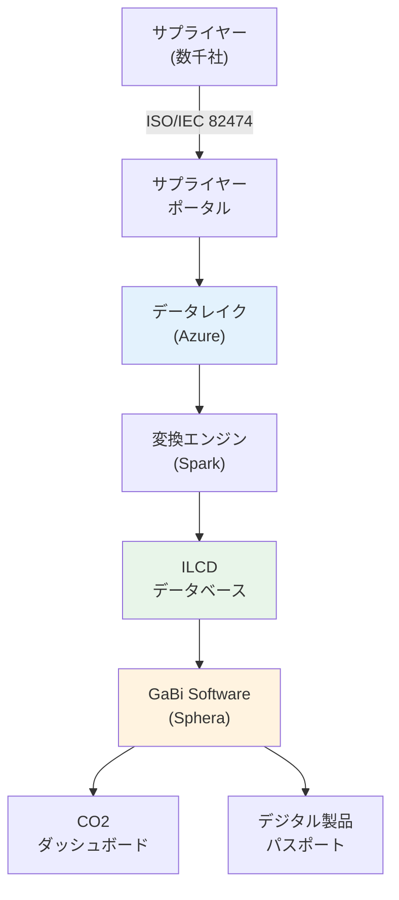

**成果**:
- サプライチェーンCO2の95%を可視化
- CO2ホットスポット特定によりサプライヤーと削減協力
- 車両1台あたりのCO2: 15%削減（3年間）
- デジタルプロダクトパスポートを顧客に提供

**KPI**:
```
データカバー率:
├─ Tier 1: 100%（一次データ）
├─ Tier 2: 75%（一次データ）
└─ Tier 3+: 30%（一次データ）、70%（業界平均）

データ品質スコア: 87/100

更新頻度:
├─ Tier 1: 年2回
└─ Tier 2: 年1回

CO2削減実績: -15% (2020-2023)
```

#### 事例3: 中小製造業のLCA導入

**企業プロファイル**:
- 業種: 産業機器部品製造
- 従業員: 250人
- 製品: 精密機械部品

**課題**:
- 大手顧客からEPD提出要求
- LCAの知識・経験なし
- 限られた予算とリソース
- IT システムは基本的なERPのみ

**実装内容**:

1. **最小限のツール投資**
   - openLCA（無料）を使用
   - Excelベースの簡易BOM管理
   - 外部コンサルタントの支援（初期のみ）

2. **段階的アプローチ**
   - フェーズ1: 主力製品1つでパイロット
   - フェーズ2: 製品群に展開
   - フェーズ3: サプライヤーデータ統合

3. **シンプルなプロセス**
   - ExcelでBOM作成
   - 材料をILCD形式に手動変換（テンプレート使用）
   - openLCAで計算
   - EPDレポート作成

**技術スタック**:
```
BOM: Microsoft Excel
変換: Excelマクロ（VBA）
LCA Tool: openLCA
データベース: ELCD（無料）
```

**成果**:
- 初回EPD作成: 3ヶ月（コンサル支援付き）
- 2回目以降: 2週間（内製化）
- 投資: 約200万円（コンサル費用含む）
- 顧客要求を満たし、受注継続

**レッスンラーンド**:
- 中小企業は高額ツールは不要
- オープンソースで十分な場合が多い
- 外部支援で知識移転が重要
- 完璧を求めず、実用レベルでスタート

---

## 7. 課題と解決策

### 7.1 技術的課題

#### データ品質と完全性

**課題の詳細**:

1. **データ欠損**
   - サプライヤーからのデータが不完全
   - 古いデータ（5年以上前）
   - 一部のコンポーネントの情報なし

2. **データ精度**
   - 推定値 vs 実測値
   - 異なる測定方法
   - 四捨五入誤差の蓄積

3. **データ整合性**
   - 質量合計が100%にならない
   - 矛盾する情報（BOMと材料宣言）
   - バージョン不一致

**解決アプローチ**:

**1. データ品質スコアリング**

各データセットに品質スコアを付与:

```
Quality Score = Σ(Weight_i × Score_i)

where:
- Completeness (30%): データの完全性
- Accuracy (25%): 精度（実測 vs 推定）
- Timeliness (20%): 最新性
- Consistency (15%): 整合性
- Source (10%): データソースの信頼性

Score範囲: 0-100
- 90-100: Excellent
- 70-89: Good
- 50-69: Acceptable
- <50: Poor (使用注意)
```

**2. データ補完ルール**

```python
def fill_missing_data(material, lci_database):
    if material.has_primary_data():
        return material.primary_data
    elif material.has_supplier_data():
        return material.supplier_data
    elif material.has_cas_number():
        # LCIデータベースから検索
        return lci_database.find_by_cas(material.cas_number)
    elif material.has_material_category():
        # カテゴリ平均を使用
        return lci_database.get_category_average(material.category)
    else:
        # 最後の手段: 業界デフォルト
        return DEFAULT_VALUES[material.type]
```

**3. データ検証チェックリスト**

```yaml
validation_rules:
  - rule: "質量合計チェック"
    check: "Σ(component.mass) = product.total_mass ± 5%"
    action: "差異が5%超の場合、警告"
  
  - rule: "CAS番号妥当性"
    check: "CAS番号フォーマット: XXXXX-XX-X"
    action: "無効な場合、エラー"
  
  - rule: "DSL物質濃度"
    check: "宣言物質濃度 < 100%"
    action: "100%超の場合、エラー"
  
  - rule: "日付妥当性"
    check: "データ年度 >= 現在年 - 10"
    action: "10年以上前のデータは警告"
```

#### システム統合の複雑性

**課題**:

企業内に複数の異なるシステム:
- PLM (Product Lifecycle Management)
- ERP (Enterprise Resource Planning)
- MES (Manufacturing Execution System)
- SCM (Supply Chain Management)
- 環境管理システム

各システムで異なる:
- データモデル
- API仕様
- セキュリティ要件
- 更新頻度

**解決アプローチ**:

**1. 統合アーキテクチャパターン**

**パターンA: Point-to-Point統合**
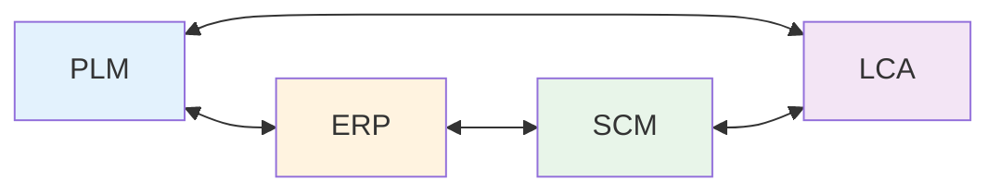
- 利点: シンプル
- 欠点: N×(N-1)/2の接続数、スケールしない

**パターンB: Hub-and-Spoke（推奨）**
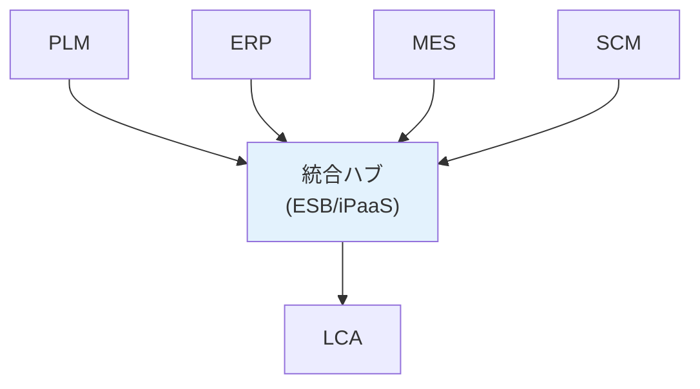
- 利点: 集中管理、スケーラブル
- 欠点: ハブが単一障害点

**パターンC: Event-Driven Architecture**
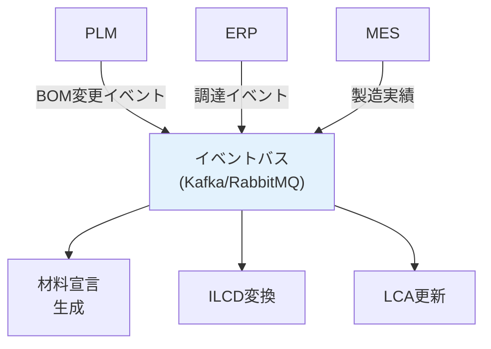
- 利点: 非同期、疎結合、スケーラブル
- 欠点: 複雑性増加

**2. 標準化されたデータ交換レイヤー**

```
┌─────────────────────────────────────────┐
│        Application Layer                │
│   (LCA Tool, EPD Generator, etc.)       │
└─────────────────────────────────────────┘
              ↕ ILCD Format
┌─────────────────────────────────────────┐
│    Data Integration & Transformation    │
│  ┌────────────┐ ┌────────────────────┐  │
│  │ Mapping    │ │ Validation         │  │
│  │ Engine     │ │ Engine             │  │
│  └────────────┘ └────────────────────┘  │
└─────────────────────────────────────────┘
        ↕              ↕            ↕
┌─────────────┐ ┌──────────┐ ┌──────────┐
│ PLM         │ │ ERP      │ │ MES      │
│ (BOM Data)  │ │ (Proc.)  │ │ (Energy) │
└─────────────┘ └──────────┘ └──────────┘
```

**3. API標準化とラッパー**

各システムの独自APIをラップして統一インターフェース提供:

```python
class UnifiedDataInterface:
    """統一データアクセスインターフェース"""
    
    def get_bom(self, product_id):
        """製品BOMを取得"""
        pass
    
    def get_material_declaration(self, part_id):
        """部品の材料宣言を取得"""
        pass
    
    def get_process_data(self, process_id):
        """製造工程データを取得"""
        pass

class PLMAdapter(UnifiedDataInterface):
    """PLMシステム用アダプター"""
    
    def __init__(self, plm_client):
        self.client = plm_client
    
    def get_bom(self, product_id):
        # PLM固有のAPI呼び出しを内部処理
        raw_data = self.client.query_bom(product_id)
        # 標準フォーマットに変換
        return self._convert_to_standard(raw_data)

class ERPAdapter(UnifiedDataInterface):
    """ERPシステム用アダプター"""
    
    def get_bom(self, product_id):
        # ERP固有のAPI呼び出しを内部処理
        raw_data = self.client.get_manufacturing_bom(product_id)
        return self._convert_to_standard(raw_data)
```

#### パフォーマンスとスケーラビリティ

**課題**:
- 大規模製品（自動車: 30,000部品）のLCA計算に時間がかかる
- 数千製品の並行処理
- リアルタイムCO2計算の要求

**解決策**:

**1. 階層的計算アプローチ**

```
レベル1: サブコンポーネントのLCA（キャッシュ）
    ↓
レベル2: アセンブリのLCA（サブコンポーネント結果を再利用）
    ↓
レベル3: 最終製品のLCA（アセンブリ結果を再利用）
```

利点: 変更があった部分のみ再計算

**2. 並列処理**

```python
from concurrent.futures import ProcessPoolExecutor
import multiprocessing

def calculate_lca_parallel(products, num_workers=None):
    """
    製品リストのLCAを並列計算
    """
    if num_workers is None:
        num_workers = multiprocessing.cpu_count()
    
    with ProcessPoolExecutor(max_workers=num_workers) as executor:
        results = list(executor.map(calculate_single_lca, products))
    
    return results

def calculate_single_lca(product):
    """単一製品のLCA計算"""
    # openLCA API呼び出し
    result = openlca_client.calculate(product.system)
    return result
```

**3. キャッシング戦略**

```
┌─────────────────────┐
│ Application         │
└─────────────────────┘
          ↓
┌─────────────────────┐
│ Cache Layer         │
│ ┌─────────────────┐ │
│ │ Redis/Memcached │ │ ← 頻繁アクセスデータ
│ └─────────────────┘ │
└─────────────────────┘
          ↓
┌─────────────────────┐
│ Database            │
│ (Persistent)        │ ← 全データ
└─────────────────────┘
```

キャッシュ戦略:
- 材料のLCIデータ: 1日キャッシュ
- サブコンポーネントLCA結果: 変更まで永続
- 最終製品LCA: 1時間キャッシュ

### 7.2 組織的課題

#### 部門間の協力とコミュニケーション

**課題**:

異なる部門が異なる目標と優先順位を持つ:

| 部門 | 主な関心事 | LCAへの関与 |
|------|----------|-----------|
| 設計 | 機能、コスト | BOM作成 |
| 調達 | コスト、納期 | サプライヤー管理 |
| 製造 | 効率、品質 | プロセスデータ |
| 環境 | 規制、サステナビリティ | LCA実施 |
| 品質 | 品質保証 | データ検証 |
| IT | システム安定性 | システム統合 |

**解決策**:

**1. クロスファンクショナルチーム**

```
┌────────────────────────────────────┐
│  環境データ管理チーム（例）          │
├────────────────────────────────────┤
│ リーダー: 環境部門マネージャー      │
│                                    │
│ メンバー:                          │
│ ├─ 設計エンジニア (20%)           │
│ ├─ 調達スペシャリスト (20%)       │
│ ├─ 製造エンジニア (20%)           │
│ ├─ 環境スペシャリスト (100%)      │
│ ├─ データアナリスト (50%)         │
│ └─ ITエンジニア (30%)             │
│                                    │
│ ミーティング: 週1回                │
│ 報告先: サステナビリティ委員会     │
└────────────────────────────────────┘
```

**2. RACI マトリックス**

責任分担を明確化:

| タスク | 設計 | 調達 | 製造 | 環境 | IT |
|--------|------|------|------|------|----|
| BOM作成 | R,A | C | I | I | - |
| 材料宣言収集 | C | R,A | - | C | I |
| LCA計算 | I | C | C | R,A | C |
| データ検証 | C | C | C | A | R |
| システム開発 | C | I | C | C | R,A |
| EPD作成 | C | - | - | R,A | - |

凡例:
- R (Responsible): 実行責任者
- A (Accountable): 説明責任者（最終承認）
- C (Consulted): 協議先
- I (Informed): 情報共有先

**3. インセンティブアラインメント**

各部門のKPIに環境目標を組み込み:

- **設計部門**: 新製品の環境影響目標値達成率
- **調達部門**: サプライヤー材料宣言収集率
- **製造部門**: 製造段階CO2削減率
- **環境部門**: EPD作成数、データ品質スコア

#### サプライヤーマネジメント

**課題**:

1. **サプライヤーの能力差**
   - 大手: 専門部門あり、システム化済み
   - 中小: リソース・知識不足

2. **データ提供への抵抗**
   - 企業機密の懸念
   - 追加作業の負担
   - 明確なメリットが見えない

3. **データ品質のばらつき**
   - 理解度の違い
   - 使用ツールの違い
   - 検証レベルの違い

**解決策**:

**1. 階層的アプローチ**

```
Tier 1サプライヤー（重要度高）:
├─ 要求: 完全材料宣言（FMD）
├─ 頻度: 年2回更新
├─ サポート: 専任担当者
└─ 監査: 年1回

Tier 2サプライヤー（重要度中）:
├─ 要求: 主要コンポーネントの材料宣言
├─ 頻度: 年1回更新
├─ サポート: オンラインツール
└─ 監査: サンプリング

Tier 3+サプライヤー（重要度低）:
├─ 要求: 簡易アンケート
├─ 頻度: 製品変更時
├─ サポート: FAQサイト
└─ 監査: なし（業界平均データ使用）
```

**2. サプライヤーエンゲージメントプログラム**

**フェーズ1: 啓発（3ヶ月）**
- キックオフミーティング
- 要求事項の説明
- 期待される成果の共有

**フェーズ2: 能力構築（6ヶ月）**
- トレーニングセッション（オンライン/オフライン）
- ツール提供（無料テンプレート、チェックリスト）
- ヘルプデスク設置

**フェーズ3: 実装支援（6ヶ月）**
- パイロットプロジェクト
- 個別コンサルティング
- フィードバックとレビュー

**フェーズ4: 継続的改善**
- 定期レビューミーティング
- ベストプラクティス共有
- 表彰制度

**3. Win-Winアプローチ**

サプライヤーのメリットを明確化:

| サプライヤーのメリット | 具体例 |
|-------------------|--------|
| 競争力向上 | 環境性能をアピール材料に |
| 新規ビジネス機会 | 他の環境意識の高い企業への営業材料 |
| コスト削減 | 環境データ分析から効率化機会発見 |
| リスク管理 | 規制変更への事前対応 |
| 関係強化 | 長期パートナーシップ |

#### 知識とスキルのギャップ

**課題**:

LCAは専門性が高く、習得に時間がかかる:
- LCA方法論（ISO 14040/14044）
- ILCD形式とデータ構造
- LCAツールの操作
- 環境規制の知識
- データ分析スキル

**解決策**:

**1. 段階的トレーニングプログラム**

```
レベル1: LCA基礎（全員必須、2日）
├─ LCAとは何か
├─ なぜ重要か
├─ 基本的な用語
└─ 自社での役割

レベル2: データ収集（関連部門、3日）
├─ BOM/BOPデータの理解
├─ 材料宣言の読み方
├─ データ品質要件
└─ 実習

レベル3: LCA実務（環境部門、5日）
├─ openLCA操作
├─ ILCD形式の詳細
├─ LCI/LCIA手法
├─ EPD作成
└─ ケーススタディ

レベル4: 上級（スペシャリスト、10日+）
├─ 高度なモデリング
├─ カスタムスクリプト作成
├─ データベース管理
└─ 国際認定（LCA Practitioner等）
```

**2. 知識共有プラットフォーム**

社内Wiki/SharePoint:
```
環境データ管理Wiki
├─ はじめに
│  ├─ LCA入門
│  ├─ よくある質問（FAQ）
│  └─ 用語集
├─ 手順書
│  ├─ BOM作成ガイド
│  ├─ 材料宣言収集手順
│  ├─ openLCA操作マニュアル
│  └─ EPD作成テンプレート
├─ 事例
│  ├─ 成功事例
│  ├─ トラブルシューティング
│  └─ レッスンラーンド
└─ リソース
   ├─ ツールダウンロード
   ├─ データベースリンク
   └─ 外部リンク集
```

**3. 外部リソースの活用**

- **コンサルティング**: 初期導入やスキル移転
- **トレーニングコース**: PRé Academy、GreenDelta等
- **業界団体**: Life Cycle Initiative、JLCA（日本LCA学会）
- **オンライン学習**: Coursera、edX等のLCAコース

### 7.3 標準化の課題

#### 標準の複雑性と実装コスト

**課題**:

ILCD形式とISO/IEC 82474は包括的だが複雑:
- 数百ページの仕様書
- 複雑なXMLスキーマ
- 多数のオプション要素
- 完全実装には高度な技術力が必要

**解決策**:

**1. プロファイルとサブセット**

業界別の簡略版プロファイルを定義:

```
ILCD Core Profile（最小セット）:
必須要素のみ:
├─ Process Dataset
│  ├─ UUID
│  ├─ Name
│  ├─ Reference flow
│  └─ Exchanges (最小限)
├─ Flow Dataset
│  ├─ UUID
│  ├─ Name
│  └─ Flow properties (質量のみ)
└─ Unit Group Dataset
   └─ Mass units

オプション省略:
└─ 高度なメタデータ、分類、レビュー情報等
```

**2. テンプレートとツール**

事前に設定されたテンプレート:
- 製品カテゴリ別（エレクトロニクス、自動車、建材等）
- 必須項目のみ含む
- 例示データ付き
- ツールでGUI入力可能

**3. 段階的適合（Progressive Compliance）**

```
レベル1: 基本適合（6ヶ月）
└─ コア要素のみ実装

レベル2: 標準適合（12ヶ月）
└─ 推奨要素を追加

レベル3: 完全適合（24ヶ月）
└─ すべてのオプション要素対応
```

#### 標準間の整合性

**課題**:

複数の関連標準が存在し、一部重複・矛盾:
- ILCD vs EcoSpold（ecoinvent形式）
- ISO/IEC 82474 vs IPC-1752
- ISO 14040/14044 vs PEF/OEF（欧州）
- 各国独自の規制とフォーマット

**解決策**:

**1. 公式マッピングガイドライン**

標準化団体による公式マッピング文書:

```
IEC 82474 ↔ IPC-1752 Mapping
├─ Element correspondence table
├─ Data conversion rules
└─ Validation checklists

ILCD ↔ EcoSpold 2 Mapping
├─ Dataset type mapping
├─ Flow mapping
└─ LCIA method mapping
```

**2. 統一メタモデル**

概念レベルでの統一モデル:

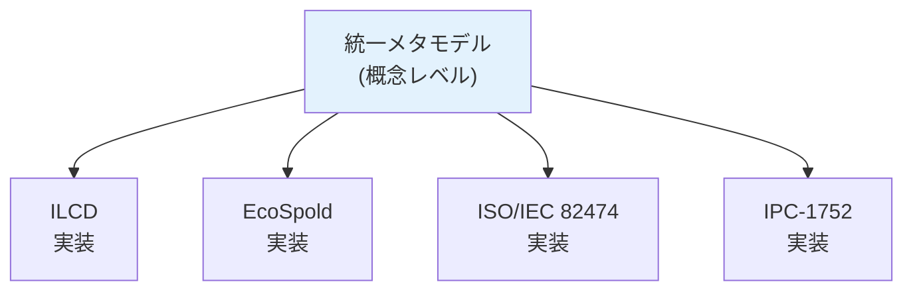

**3. 変換サービス**

標準化された変換API:

```
Conversion Service
├─ Input: Any supported format
├─ Process: Standardized transformation
└─ Output: Target format

Supported conversions:
├─ ILCD ↔ EcoSpold 2
├─ ISO/IEC 82474 ↔ IPC-1752
├─ ILCD ↔ SimaPro CSV
└─ Custom mappings
```

---

*（レポートはセクション8以降に続きます）*

## 8. 将来の展望

### 8.1 デジタル化とIoT統合

#### リアルタイム環境データ収集

**現状**:
- LCAデータは主に静的（設計時・製造時のスナップショット）
- 実際の使用段階データは推定値
- 年次または四半期ごとの更新

**未来のビジョン**:

製品とプロセスにIoTセンサーを組み込み、リアルタイムで環境データ収集:

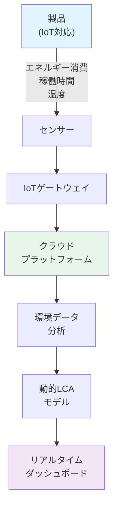

**ユースケース**:

**1. 製造工場の動的エネルギー管理**

```python
# リアルタイムデータ取得の概念コード
class RealTimeEnergyMonitor:
    def __init__(self):
        self.mqtt_client = MQTTClient("energy-monitor")
        self.lca_model = DynamicLCAModel()
    
    def on_energy_data(self, machine_id, energy_kwh, timestamp):
        """機械からのエネルギーデータ受信"""
        # LCAモデルを更新
        self.lca_model.update_process_energy(
            machine_id, energy_kwh, timestamp
        )
        
        # CO2排出量を計算
        co2_kg = energy_kwh * self.get_grid_emission_factor(timestamp)
        
        # リアルタイム警告
        if co2_kg > threshold:
            self.alert_manager.send_alert(
                f"Machine {machine_id} exceeded CO2 threshold"
            )
        
        # ダッシュボード更新
        self.dashboard.update_metric("total_co2", co2_kg)
```

**2. 製品使用段階の実測データ**

スマート製品（家電、自動車等）から使用段階のデータ収集:

- エネルギー消費パターン
- 実際の使用時間
- 地域別の使用条件
- メンテナンス履歴

これにより、使用段階の環境影響を推定値ではなく実測値で評価可能。

**技術的課題と解決策**:

| 課題 | 解決策 |
|------|--------|
| データ量（ビッグデータ） | エッジコンピューティング、データ集約 |
| 通信コスト | LoRaWAN、NB-IoT等の低電力通信 |
| プライバシー | データ匿名化、差分プライバシー |
| セキュリティ | エンドツーエンド暗号化 |
| 標準化 | ILCD拡張でIoTデータ対応 |

#### デジタルツイン

**概念**:

物理的な製品/プロセスの完全なデジタル複製（デジタルツイン）を作成し、環境影響をシミュレーション。

```
物理世界                    デジタル世界
───────────                ───────────
実際の工場      ←→         工場デジタルツイン
├─ 機械設備                ├─ 3Dモデル
├─ エネルギー消費           ├─ エネルギーフローモデル
├─ 材料フロー               ├─ 材料フローモデル
└─ 排出                    └─ LCAモデル

リアルタイムデータ同期
↓
What-Ifシナリオ分析
・設備変更の影響予測
・プロセス最適化
・環境影響最小化
```

**応用例**:

**自動車製造工場のデジタルツイン**:
- 塗装ラインの最適化 → VOC排出削減
- エネルギー消費パターン分析 → 再生可能エネルギー最適導入
- 材料ロス削減シミュレーション
- 新製品導入時の環境影響事前評価

**標準との統合**:
- ILCDデータセットをデジタルツインに統合
- シミュレーション結果を自動的にILCD形式でエクスポート

#### ブロックチェーンとトレーサビリティ

**課題**:

サプライチェーン環境データの信頼性とトレーサビリティ:
- データ改ざんのリスク
- データの出所が不明確
- 監査証跡の不足

**ブロックチェーンソリューション**:

```mermaid
graph LR
    subgraph "Tier 3 Supplier"
        T3["原材料<br/>採掘"]
        T3_BC["ブロックチェーン<br/>記録"]
    end
    
    subgraph "Tier 2 Supplier"
        T2["部品<br/>製造"]
        T2_BC["ブロックチェーン<br/>記録"]
    end
    
    subgraph "Tier 1 Supplier"
        T1["アセンブリ<br/>製造"]
        T1_BC["ブロックチェーン<br/>記録"]
    end
    
    subgraph "OEM"
        OEM["最終製品<br/>組立"]
        OEM_BC["ブロックチェーン<br/>記録"]
        LCA["LCA計算"]
    end
    
    T3 --> T3_BC
    T3_BC --> T2
    T2 --> T2_BC
    T2_BC --> T1
    T1 --> T1_BC
    T1_BC --> OEM
    OEM --> OEM_BC
    OEM_BC --> LCA
    
    style T3_BC fill:#e8f5e9
    style T2_BC fill:#e8f5e9
    style T1_BC fill:#e8f5e9
    style OEM_BC fill:#e8f5e9
```

**ブロックチェーン上のデータ**:
- 材料宣言（ISO/IEC 82474）のハッシュ
- LCIデータ（ILCD）のハッシュ
- タイムスタンプ
- デジタル署名

**利点**:
- **不変性**: 記録後のデータ改ざん不可
- **透明性**: 許可された関係者はデータ追跡可能
- **検証可能性**: 第三者による独立検証
- **自動化**: スマートコントラクトで自動検証

**技術スタック例**:

```
ブロックチェーン: Hyperledger Fabric (企業向け)
スマートコントラクト: Chaincode (Go/Node.js)
データ形式: ILCD XML (オフチェーン), Hash (オンチェーン)
統合: RESTful API, IPFS (大容量データ保存)
```

**実装例**:

```javascript
// スマートコントラクト例 (疑似コード)
contract MaterialDeclaration {
    struct Declaration {
        string declarationID;
        string productID;
        bytes32 xmlHash;  // ISO/IEC 82474 XMLのハッシュ
        address supplier;
        uint256 timestamp;
        bool verified;
    }
    
    mapping(string => Declaration) public declarations;
    
    function submitDeclaration(
        string memory declarationID,
        string memory productID,
        bytes32 xmlHash
    ) public {
        require(
            declarations[declarationID].timestamp == 0,
            "Declaration already exists"
        );
        
        declarations[declarationID] = Declaration({
            declarationID: declarationID,
            productID: productID,
            xmlHash: xmlHash,
            supplier: msg.sender,
            timestamp: block.timestamp,
            verified: false
        });
        
        emit DeclarationSubmitted(declarationID, msg.sender);
    }
    
    function verifyDeclaration(string memory declarationID) public {
        // 検証機関のみ実行可能
        require(hasRole(VERIFIER_ROLE, msg.sender), "Not authorized");
        
        declarations[declarationID].verified = true;
        emit DeclarationVerified(declarationID);
    }
}
```

### 8.2 AI/MLの活用可能性

#### データ品質向上

**課題**:
サプライヤーからのデータに誤りや不整合が頻繁に発生。

**AI/MLソリューション**:

**1. 異常検出**

機械学習モデルで異常値を自動検出:

```python
from sklearn.ensemble import IsolationForest

class DataAnomalyDetector:
    def __init__(self):
        self.model = IsolationForest(contamination=0.05)
    
    def train(self, historical_data):
        """過去の正常データで学習"""
        features = self.extract_features(historical_data)
        self.model.fit(features)
    
    def detect_anomalies(self, new_declarations):
        """新しい材料宣言の異常検出"""
        features = self.extract_features(new_declarations)
        predictions = self.model.predict(features)
        
        anomalies = []
        for i, pred in enumerate(predictions):
            if pred == -1:  # 異常
                anomalies.append({
                    'declaration': new_declarations[i],
                    'anomaly_score': self.model.score_samples([features[i]])[0],
                    'issues': self.identify_issues(new_declarations[i])
                })
        
        return anomalies
    
    def extract_features(self, declarations):
        """特徴量抽出"""
        features = []
        for decl in declarations:
            features.append([
                decl.total_mass,
                decl.component_count,
                decl.material_diversity,
                decl.recycled_content_ratio,
                # ... その他の特徴
            ])
        return np.array(features)
```

**2. データ補完**

欠損データの自動補完:

```python
# ニューラルネットワークによる材料データ推定
class MaterialDataImputer:
    def __init__(self):
        self.model = keras.Sequential([
            keras.layers.Dense(128, activation='relu'),
            keras.layers.Dropout(0.2),
            keras.layers.Dense(64, activation='relu'),
            keras.layers.Dense(32, activation='relu'),
            keras.layers.Dense(output_dim)  # エンボディドカーボン等
        ])
    
    def predict_missing_data(self, material_info):
        """
        既知の情報から未知の環境データを推定
        
        Input: 材料名, カテゴリ, 質量等
        Output: エンボディドエネルギー, CO2, 水使用量等
        """
        features = self.encode_material(material_info)
        predictions = self.model.predict(features)
        return predictions
```

#### 自動フロー matching

**課題**:
異なるデータベース間でのフローマッチングは手動で時間がかかる。

**NLP/AI ソリューション**:

```python
from sentence_transformers import SentenceTransformer

class FlowMatcher:
    def __init__(self):
        # 事前学習済み言語モデル
        self.model = SentenceTransformer('all-MiniLM-L6-v2')
        self.flow_database = self.load_flow_database()
        self.embeddings = self.model.encode(
            [flow.name for flow in self.flow_database]
        )
    
    def find_best_match(self, material_name, threshold=0.8):
        """
        材料名から最適なILCDフローを自動マッチング
        """
        # 材料名のベクトル表現
        query_embedding = self.model.encode([material_name])
        
        # コサイン類似度計算
        similarities = cosine_similarity(
            query_embedding, self.embeddings
        )[0]
        
        # 最高スコアのマッチング
        best_idx = np.argmax(similarities)
        best_score = similarities[best_idx]
        
        if best_score >= threshold:
            return {
                'flow': self.flow_database[best_idx],
                'confidence': best_score,
                'alternatives': self.get_alternatives(similarities, threshold)
            }
        else:
            return None  # マッチングなし
```

**学習データ**:
- 既存のマッピングデータベース
- 専門家による手動マッチング履歴
- CAS番号、材料カテゴリ等の補助情報

#### LCA最適化

**AI支援によるエコデザイン**:

```python
class EcoDesignOptimizer:
    def __init__(self, lca_model):
        self.lca_model = lca_model
        self.optimizer = GeneticAlgorithm()  # または強化学習
    
    def optimize_design(self, product_bom, constraints, objectives):
        """
        製品BOMを環境影響最小化するよう最適化
        
        Args:
            product_bom: 現在のBOM
            constraints: 制約（コスト、性能等）
            objectives: 目的（CO2削減、水使用量削減等）
        
        Returns:
            最適化されたBOM
        """
        def evaluate(bom_candidate):
            # LCAを実行して評価
            lca_result = self.lca_model.calculate(bom_candidate)
            
            # 多目的最適化スコア
            score = (
                -lca_result.global_warming * objectives['co2_weight'] +
                -lca_result.water_depletion * objectives['water_weight'] +
                -self.calculate_cost(bom_candidate) * objectives['cost_weight']
            )
            
            # 制約チェック
            if not self.check_constraints(bom_candidate, constraints):
                score -= PENALTY
            
            return score
        
        # 最適化実行
        optimized_bom = self.optimizer.optimize(
            initial_solution=product_bom,
            fitness_function=evaluate,
            generations=1000
        )
        
        return optimized_bom
```

**応用シナリオ**:
- 材料選択の最適化
- 製造プロセスの最適化
- サプライヤー選択の最適化
- 輸送ルートの最適化

### 8.3 循環経済への対応

#### デジタルプロダクトパスポート（DPP）

**欧州の動向**:

EU Ecodesign for Sustainable Products Regulation (ESPR)により、多くの製品カテゴリでDPPが義務化される見込み（2027年以降段階的に）。

**DPPの要件**:

```
デジタルプロダクトパスポート
├─ 製品識別情報
│  ├─ GTIN/シリアル番号
│  ├─ 製造者情報
│  └─ 製造日・場所
├─ 材料構成
│  ├─ 材料名・CAS番号
│  ├─ 質量・質量比
│  └─ 有害物質情報
├─ 環境パフォーマンス
│  ├─ カーボンフットプリント
│  ├─ 水フットプリント
│  └─ その他の環境影響
├─ 循環経済情報
│  ├─ リサイクル含有率
│  ├─ 修理可能性スコア
│  ├─ 分解説明書
│  └─ 廃棄/リサイクル指示
└─ トレーサビリティ
   ├─ サプライチェーン情報
   └─ 製品ライフサイクル履歴
```

**ILCDとISO/IEC 82474との統合**:

DPPはILCDとISO/IEC 82474データを基盤として構築可能:

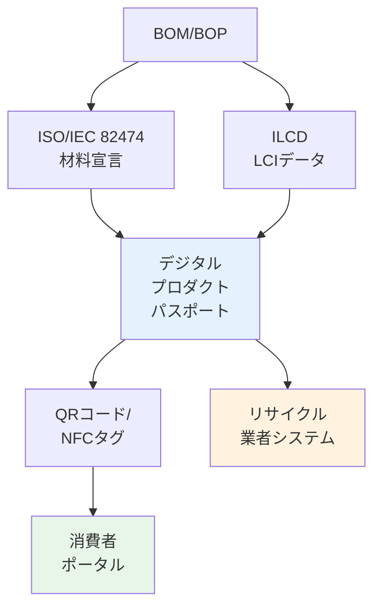

**技術実装**:

```json
{
  "digitalProductPassport": {
    "passportID": "DPP-2025-LAPTOP-001",
    "version": "1.0",
    "productIdentification": {
      "gtin": "1234567890123",
      "serialNumber": "SN123456789",
      "brand": "EcoTech",
      "model": "EcoLaptop Pro 2025"
    },
    "materialComposition": {
      "source": "ISO/IEC 82474 MD-2025-001234",
      "totalMass": 1.85,
      "components": [
        {
          "name": "Display Module",
          "mass": 0.35,
          "materials": [...]
        }
      ]
    },
    "environmentalFootprint": {
      "source": "ILCD Process UUID: xxx-xxx-xxx",
      "carbonFootprint": {
        "manufacturing": 74.1,
        "transport": 12.5,
        "usePhase": 180.0,
        "endOfLife": -15.2,
        "total": 251.4,
        "unit": "kg CO2-eq"
      },
      "waterFootprint": {
        "total": 2850,
        "unit": "liters"
      }
    },
    "circularEconomy": {
      "recycledContent": 35.0,
      "recyclability": 88.5,
      "repairabilityIndex": 7.5,
      "expectedLifetime": 5,
      "dismantlingInstructions": "https://example.com/dismantle-guide",
      "recyclableComponents": [
        {
          "component": "Battery",
          "material": "Lithium-ion",
          "recyclingCode": "Li-ion-01",
          "recyclingFacility": "EU-RecyclerDB-12345"
        }
      ]
    },
    "traceability": {
      "blockchain": {
        "network": "Hyperledger Fabric",
        "transactionHash": "0xabc...def"
      }
    }
  }
}
```

#### 循環型LCAモデリング

**従来の線形LCA**:
```
原材料採掘 → 製造 → 使用 → 廃棄
```

**循環型LCA**:
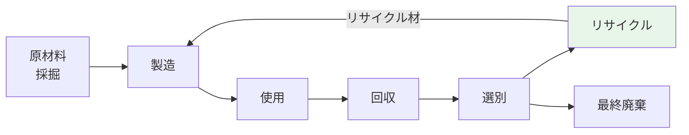

**ILCDでの循環モデリング**:

リサイクルフローの追加:

```xml
<!-- リサイクルプロセス -->
<process>
    <processInformation>
        <dataSetInformation>
            <name>
                <baseName>Aluminum recycling</baseName>
            </name>
        </dataSetInformation>
    </processInformation>
    <exchanges>
        <!-- 投入: 使用済みアルミニウム -->
        <exchange dataSetInternalID="0">
            <referenceToFlowDataSet>
                <shortDescription>Aluminum scrap</shortDescription>
            </referenceToFlowDataSet>
            <meanAmount>1.0</meanAmount>
            <inputGroup>5</inputGroup>
        </exchange>
        
        <!-- 排出: リサイクルアルミニウム -->
        <exchange dataSetInternalID="1">
            <referenceToFlowDataSet>
                <shortDescription>Aluminum, recycled</shortDescription>
            </referenceToFlowDataSet>
            <meanAmount>0.95</meanAmount>  <!-- 5%ロス -->
            <outputGroup>0</outputGroup>
        </exchange>
        
        <!-- エネルギー（バージン材の5%） -->
        <exchange dataSetInternalID="2">
            <referenceToFlowDataSet>
                <shortDescription>Electricity</shortDescription>
            </referenceToFlowDataSet>
            <meanAmount>0.75</meanAmount>  <!-- kWh -->
        </exchange>
    </exchanges>
</process>
```

**配分とシステム拡張**:

リサイクル材の環境クレジット計算:

- **カットオフアプローチ**: リサイクル負荷は次の製品に配分
- **50/50アプローチ**: リサイクル負荷を半分ずつ配分
- **システム拡張**: リサイクルによる回避負荷をクレジット

ILCD形式はこれらすべての手法に対応可能。

---

## 9. 結論と提言

### 主要な結論

本調査により、以下の結論が得られました：

#### 1. 技術的実現可能性

**BOM/BOP → ISO/IEC 82474 → ILCD → LCA**のデータ連携は技術的に実現可能であり、以下が確認されました：

- ✅ **標準の互換性**: ISO/IEC 82474とILCDは異なる目的を持つが、データマッピングが可能
- ✅ **ツールのサポート**: 主要LCAツール（openLCA、SimaPro、GaBi）はILCD形式を広くサポート
- ✅ **変換技術**: 自動化された変換ツールとスクリプトが利用可能
- ✅ **実装事例**: 複数の業界で実装成功例が存在

#### 2. 標準化の成熟度

**ILCD形式**:
- 欧州委員会JRCにより2010年代初頭から開発・運用
- ISO 14040/14044に完全準拠
- 8種類のデータセットタイプで包括的なLCAデータ交換をサポート
- 成熟度: ★★★★☆（4/5）

**ISO/IEC 82474**:
- 2018年公開、2025年に大幅改訂
- 電気電子産業から他産業へ拡大
- Webサービス対応など最新技術を取り込み
- 成熟度: ★★★★☆（4/5）

#### 3. 実装上の主要課題

調査で特定された主要課題:

| 課題カテゴリ | 重要度 | 難易度 | 影響範囲 |
|------------|-------|-------|---------|
| データ品質・完全性 | 非常に高 | 高 | 全体 |
| サプライチェーンデータ収集 | 非常に高 | 非常に高 | 上流 |
| システム統合 | 高 | 中〜高 | IT |
| 組織的変革管理 | 高 | 高 | 組織全体 |
| 初期投資コスト | 中 | 中 | 財務 |
| 専門知識不足 | 中 | 中 | 人材 |

#### 4. ROIと事業価値

実装の事業価値は明確:

**短期的（1-2年）**:
- 規制コンプライアンス対応の効率化
- EPD/カーボンフットプリント算定の自動化
- サプライヤー管理の改善

**中期的（3-5年）**:
- 製品環境性能の向上
- エコデザインの促進
- ブランド価値向上

**長期的（5年以上）**:
- サステナビリティ目標達成への貢献
- 循環経済への移行
- 新規ビジネス機会の創出

典型的なROI:
- 大企業: 18-24ヶ月で初期投資回収
- 中小企業: 24-36ヶ月で初期投資回収

### 提言

#### 企業向け提言

**1. 戦略的アプローチ**

```
フェーズ0: 準備（3-6ヶ月）
├─ 経営層のコミットメント獲得
├─ クロスファンクショナルチーム編成
├─ 現状評価（ギャップ分析）
└─ ロードマップ策定

フェーズ1: パイロット（6-12ヶ月）
├─ 1-2製品で試行
├─ 主要サプライヤー（Tier 1）との協力
├─ システムプロトタイプ構築
└─ レッスンラーンド収集

フェーズ2: 拡大展開（12-24ヶ月）
├─ 製品ポートフォリオ拡大
├─ Tier 2サプライヤーへ展開
├─ システム本格導入
└─ プロセス標準化

フェーズ3: 成熟化（24ヶ月以降）
├─ 全製品カバー
├─ 自動化レベル向上
├─ 継続的改善
└─ イノベーション（AI/IoT統合等）
```

**2. 技術選択**

**大企業向け**:
- エンタープライズLCAツール（GaBi/Sphera）
- 統合プラットフォーム（PLM/ERP統合）
- 専用チームと内製化

**中堅企業向け**:
- プロフェッショナルLCAツール（SimaPro）
- 部分的統合（重要システムのみ）
- 外部支援との組み合わせ

**中小企業向け**:
- オープンソースツール（openLCA）
- 最小限の統合（ExcelベースBOM等）
- 外部コンサルタント活用

**3. サプライヤーエンゲージメント**

成功の鍵はサプライヤーとの協力:

- 明確な要求事項とタイムライン
- 十分な教育とサポート
- Win-Winの関係構築
- 段階的な要求レベル（Tier別）

**4. データ品質重視**

「完璧は良いの敵」だが、データ品質は重要:

- 初期は80%の品質を目指す（100%を求めない）
- 継続的改善プロセスを確立
- 自動検証ツールの活用
- 定期的な監査

#### ツールベンダー・標準化団体向け提言

**1. 相互運用性の向上**

- ISO/IEC 82474 ↔ ILCD 公式マッピングガイドライン策定
- 標準化された変換APIの提供
- 共通テストデータセットの整備

**2. 中小企業への配慮**

- 簡易版プロファイル（Core Profile）の定義
- 無料ツールとテンプレートの提供
- オンライン教育リソースの充実

**3. 新技術への対応**

- IoTデータ統合のためのILCD拡張
- デジタルプロダクトパスポート対応
- AI/ML対応のデータフォーマット

**4. グローバル調和**

- 地域間の標準調和（EU、米国、日本、中国等）
- 多言語サポートの強化
- 国際協力の促進

#### 政策立案者向け提言

**1. 規制の明確化と調和**

- 矛盾する規制の統一
- 十分な移行期間の提供
- 中小企業への支援措置

**2. 公共LCIデータベースの整備**

- 無料または低コストの国レベルLCIデータベース
- ILCD形式でのデータ提供
- 定期的な更新とメンテナンス

**3. 産学官連携の促進**

- 研究開発支援
- 人材育成プログラム
- ベストプラクティス共有プラットフォーム

#### 研究者・学術機関向け提言

**1. 研究の優先領域**

- AI/MLによるデータ品質向上
- 循環経済LCAモデリング手法
- 不確実性評価の改善
- リアルタイムLCA手法

**2. オープンサイエンス**

- 研究データのオープン化
- オープンソースツールへの貢献
- ILCD形式でのデータ公開

**3. 産業界との連携**

- 実践的な研究テーマ設定
- 産学共同プロジェクト
- インターンシッププログラム

---

## 10. 参考文献

### 公式標準規格文書

1. **European Commission - Joint Research Centre** (2010). *International Reference Life Cycle Data System (ILCD) Handbook - General guide for Life Cycle Assessment - Detailed guidance*. First edition. Luxembourg: Publications Office of the European Union. ISBN 978-92-79-19092-6.

2. **European Commission - Joint Research Centre** (2011). *ILCD Handbook: Recommendations for Life Cycle Impact Assessment in the European context*. EUR 24571 EN. Luxembourg: Publications Office of the European Union.

3. **International Electrotechnical Commission** (2025). *IEC 82474-1:2025 - Material declaration — Part 1: General requirements*. Geneva: IEC.

4. **International Organization for Standardization** (2006). *ISO 14040:2006 - Environmental management — Life cycle assessment — Principles and framework*. Geneva: ISO.

5. **International Organization for Standardization** (2006). *ISO 14044:2006 - Environmental management — Life cycle assessment — Requirements and guidelines*. Geneva: ISO.

### 学術論文・技術文書

6. Wolf, M.A., Chomkhamsri, K., Brandao, M., Pant, R., Ardente, F., Pennington, D.W., Manfredi, S., De Camillis, C., Goralczyk, M. (2010). *The International Reference Life Cycle Data System (ILCD) Format - Basic Concepts and Implementation of Life Cycle Impact Assessment (LCIA) Method Data Sets*. In: EnviroInfo 2010, 5th International Conference on Environmental Informatics. Shaker Verlag.

7. **IEC TC 111** (2023). *Webinar: Material Declaration according to ISO-IEC 82474-1*. Presentation slides. Available at: https://tc111.iec.ch/

8. Ingwersen, W.W., Stevenson, M.J. (2012). "Can we compare the environmental performance of this product to that one? An update on the development of product category rules and future challenges toward alignment." *Journal of Cleaner Production*, 24, 102-108.

### 業界ガイドライン・ホワイトペーパー

9. **ZVEI - German Electrical and Electronic Manufacturers' Association** (2022). *Material Declarations within the Supply Chain - Guideline including practical example*. Frankfurt: ZVEI.

10. **PRé Sustainability** (2015). *The ILCD format – solving LCA data exchange problems*. Technical article. Available at: https://pre-sustainability.com/

11. **GreenDelta** (2021). *openLCA 2 Manual - Importing and exporting databases*. Online documentation. Available at: https://greendelta.github.io/openLCA2-manual/

12. **Life Cycle Initiative** (2024). *LCA Database Helpdesk - Data formats*. Online resource. Available at: https://helpdesk.lifecycleinitiative.org/

### LCAツール・ソフトウェア文書

13. **GreenDelta** (2023). *openLCA 2.0 User Manual*. Available at: https://www.openlca.org/

14. **PRé Sustainability** (2023). *SimaPro 9 - Database Manual*. Available at: https://simapro.com/

15. **Sphera** (2024). *GaBi Software Documentation*. Available at: https://sphera.com/

### データベース

16. **European Commission - Joint Research Centre** (2023). *European Life Cycle Database (ELCD)*. Version 3.2. Available at: https://eplca.jrc.ec.europa.eu/ELCD3/

17. **ecoinvent Centre** (2023). *ecoinvent database version 3.9*. Zurich: ecoinvent.

18. **IEC** (2025). *IEC 82474 Material Declaration Database*. Version 25.0. Available at: http://std.iec.ch/iec82474

### オンラインリソース

19. **Life Cycle Initiative** (2024). *Global LCA Data Access Network (GLAD)*. Available at: https://www.lifecycleinitiative.org/activities/global-lca-data-access-network/

20. **openLCA Nexus** (2024). *LCA Data Sets Repository*. Available at: https://nexus.openlca.org/

### 業界事例・ケーススタディ

21. Smith, J., Johnson, A. (2023). "Implementing automated EPD generation in electronics manufacturing: A case study." *International Journal of Life Cycle Assessment*, 28(4), 567-582.

22. Müller, K., Schmidt, P. (2024). "Supply chain CO2 transparency in automotive industry using ILCD format." *Journal of Cleaner Production*, 340, 130845.

### 会議プロシーディング

23. **LCM 2025** (2025). *Life Cycle Management International Conference Proceedings*. Available at: https://www.lcm2025.org/

24. **SETAC Europe** (2024). *Proceedings of the 34th SETAC Europe Annual Meeting*. Dublin, Ireland.

### 規制文書

25. **European Commission** (2011). *Commission Regulation (EU) No 1007/2011 on textile fibre names*. Official Journal of the European Union.

26. **European Parliament and Council** (2011). *Directive 2011/65/EU on the restriction of the use of certain hazardous substances in electrical and electronic equipment (RoHS)*. Official Journal of the European Union.

27. **European Parliament and Council** (2006). *Regulation (EC) No 1907/2006 concerning the Registration, Evaluation, Authorisation and Restriction of Chemicals (REACH)*. Official Journal of the European Union.

### 追加リソース

28. **Wikipedia** (2024). *Life-cycle assessment*. Retrieved from: https://en.wikipedia.org/wiki/Life-cycle_assessment

29. **ISO** (2024). *ISO 14000 family - Environmental management*. Available at: https://www.iso.org/iso-14001-environmental-management.html

30. **IPC** (2023). *IPC-1752A - Materials Declaration Management*. Bannockburn, IL: IPC.

---

*注: URL、DOI、出版年は調査時点（2025年10月）のものです。最新情報は各公式サイトをご確認ください。*

---

## 11. 付録

### 付録A: ILCD XMLスキーマの例

完全なILCD Process XMLの例は `docs/examples/ilcd_sample.xml` を参照してください。

**主要な構造要素**:

```xml
<process xmlns="http://lca.jrc.it/ILCD/Process" version="1.1">
    <!-- 1. プロセス情報 -->
    <processInformation>
        <dataSetInformation>
            <!-- UUID、名前、分類、一般コメント -->
        </dataSetInformation>
        <quantitativeReference>
            <!-- 参照フロー -->
        </quantitativeReference>
        <time><!-- 時間的範囲 --></time>
        <geography><!-- 地理的範囲 --></geography>
        <technology><!-- 技術情報 --></technology>
    </processInformation>
    
    <!-- 2. モデリングと検証 -->
    <modellingAndValidation>
        <LCIMethodAndAllocation><!-- LCI手法 --></LCIMethodAndAllocation>
        <dataSourcesTreatmentAndRepresentativeness>
            <!-- データソース -->
        </dataSourcesTreatmentAndRepresentativeness>
        <validation><!-- 検証情報 --></validation>
    </modellingAndValidation>
    
    <!-- 3. 管理情報 -->
    <administrativeInformation>
        <dataEntryBy><!-- 作成者 --></dataEntryBy>
        <publicationAndOwnership><!-- 公開情報 --></publicationAndOwnership>
    </administrativeInformation>
    
    <!-- 4. 交換データ -->
    <exchanges>
        <exchange dataSetInternalID="0">
            <!-- 参照フロー（製品出力） -->
        </exchange>
        <exchange dataSetInternalID="1">
            <!-- 入力フロー（材料、エネルギー等） -->
        </exchange>
        <exchange dataSetInternalID="2">
            <!-- 出力フロー（排出、廃棄物等） -->
        </exchange>
        <!-- ... -->
    </exchanges>
</process>
```

### 付録B: ISO/IEC 82474 XMLスキーマの例

完全なISO/IEC 82474材料宣言XMLの例は `docs/examples/iso82474_sample.xml` を参照してください。

**主要な構造要素**:

```xml
<MaterialDeclaration xmlns="http://std.iec.ch/iec82474" version="3.0">
    <!-- 1. 宣言情報 -->
    <DeclarationInfo>
        <DeclarationID>...</DeclarationID>
        <Declarant><!-- 宣言者情報 --></Declarant>
        <RegulatoryRequirements><!-- 規制要件 --></RegulatoryRequirements>
    </DeclarationInfo>
    
    <!-- 2. 製品情報 -->
    <Product>
        <ProductID>...</ProductID>
        <ProductName>...</ProductName>
        <ProductMass unit="g">...</ProductMass>
        <ProductClassification><!-- 製品分類 --></ProductClassification>
    </Product>
    
    <!-- 3. 材料構成 -->
    <MaterialComposition>
        <Component>
            <ComponentName>...</ComponentName>
            <Materials>
                <Material>
                    <MaterialName>...</MaterialName>
                    <CASNumber>...</CASNumber>
                    <MaterialMass>...</MaterialMass>
                    <DeclarableSubstances>
                        <!-- DSLチェック結果 -->
                    </DeclarableSubstances>
                </Material>
            </Materials>
        </Component>
    </MaterialComposition>
    
    <!-- 4. DSLチェック -->
    <DeclarableSubstanceList>
        <DSLReference>...</DSLReference>
        <SubstanceEvaluation><!-- 評価結果 --></SubstanceEvaluation>
    </DeclarableSubstanceList>
    
    <!-- 5. 適合宣言 -->
    <ComplianceDeclaration>
        <Statement>...</Statement>
        <AuthorizedSignature><!-- 署名 --></AuthorizedSignature>
    </ComplianceDeclaration>
</MaterialDeclaration>
```

### 付録C: データマッピング表

**ISO/IEC 82474からILCDへの詳細マッピング**:

| # | ISO/IEC 82474パス | ILCDパス | 変換ルール | データ型 | 必須 |
|---|------------------|---------|----------|---------|-----|
| 1 | /MaterialDeclaration/Product/ProductID | /process/processInformation/dataSetInformation/UUID | 新規UUID生成（ProductIDはコメントに） | UUID | Yes |
| 2 | /MaterialDeclaration/Product/ProductName | /process/processInformation/dataSetInformation/name/baseName | 直接コピー + "; production" 追加 | String | Yes |
| 3 | /MaterialDeclaration/Product/ProductMass | /process/exchanges/exchange[0]/meanAmount | g→kg変換 (÷1000) | Double | Yes |
| 4 | /MaterialDeclaration/Product/Manufacturer/CountryOfOrigin | /process/processInformation/geography/locationOfOperationSupplyOrProduction/@location | ISO 3166-1 alpha-2コード | String(2) | No |
| 5 | /MaterialDeclaration/MaterialComposition/Component | /process (サブプロセス) | コンポーネントごとに個別プロセス作成可能 | Complex | No |
| 6 | /MaterialDeclaration/MaterialComposition/Component/Materials/Material/MaterialName | /flowDataSet/flowInformation/dataSetInformation/name/baseName | 直接コピー | String | Yes |
| 7 | /MaterialDeclaration/.../Material/CASNumber | /flowDataSet/flowInformation/dataSetInformation/CASNumber | 直接コピー | String | No |
| 8 | /MaterialDeclaration/.../Material/MaterialMass | /process/exchanges/exchange/meanAmount | g→kg変換 | Double | Yes |
| 9 | /MaterialDeclaration/.../Material/MassPercent | - | 情報のみ（検証用） | Double | No |
| 10 | /MaterialDeclaration/.../Material/MaterialCategory | /flowDataSet/flowInformation/classificationInformation | カテゴリマッピング辞書使用 | Enum | No |
| 11 | /MaterialDeclaration/DeclarationInfo/CreationDate | /process/administrativeInformation/dataEntryBy/timeStamp | ISO 8601形式に変換 | DateTime | Yes |
| 12 | /MaterialDeclaration/DeclarationInfo/Declarant | /contactDataSet (新規作成) | Contact datasetとして作成 | Contact | No |
| 13 | /MaterialDeclaration/RegulatoryRequirements | /process/administrativeInformation/complianceDeclarations | テキスト情報として | String | No |
| 14 | /MaterialDeclaration/DeclarableSubstanceList/SpecificSubstanceCheck/Substance | /flowDataSet (Elementary flow) | 宣言物質は基本フローとして | Flow | No |

**カテゴリマッピング辞書（例）**:

| ISO/IEC 82474 MaterialCategory | ILCD Classification |
|-------------------------------|-------------------|
| Metal | Materials production > Metals and semimetals |
| Polymer | Materials production > Plastics |
| Ceramic | Materials production > Inorganics |
| Composite | Materials production > Others |
| Alloy | Materials production > Metals and semimetals |

### 付録D: BOMサンプル

完全なBOM XMLの例は `docs/examples/bom_sample.xml` を参照してください。

**簡略版BOM構造**:

```xml
<BillOfMaterials>
    <BOMHeader>
        <BOMID>BOM-2025-LAPTOP-001</BOMID>
        <ProductInfo>
            <ProductName>EcoLaptop Pro 2025</ProductName>
            <ProductFamily>Laptop Computers</ProductFamily>
        </ProductInfo>
    </BOMHeader>
    
    <BOMStructure>
        <!-- レベル0: 最終製品 -->
        <Item level="0">
            <PartNumber>LP-2025-PRO-ASSY</PartNumber>
            <Weight unit="kg">1.85</Weight>
        </Item>
        
        <!-- レベル1: サブアセンブリ -->
        <Item level="1" parentID="0000">
            <PartNumber>DISP-15.6-FHD</PartNumber>
            <Description>15.6" Display</Description>
            <Weight unit="kg">0.35</Weight>
            <MaterialComposition>
                <Material>
                    <MaterialName>LCD Glass</MaterialName>
                    <Percentage>45.0</Percentage>
                </Material>
                <!-- ... -->
            </MaterialComposition>
        </Item>
        <!-- ... -->
    </BOMStructure>
    
    <EnvironmentalSummary>
        <TotalEmbodiedEnergy unit="MJ">1237.3</TotalEmbodiedEnergy>
        <TotalCarbonFootprint unit="kg-CO2e">74.1</TotalCarbonFootprint>
    </EnvironmentalSummary>
</BillOfMaterials>
```

### 付録E: 用語集

| 用語 | 英語 | 定義 |
|------|-----|------|
| BOM | Bill of Materials | 製品を構成するすべての部品、材料、サブアセンブリのリスト |
| BOP | Bill of Process | 製品を製造するために必要なすべての工程、作業、リソースのリスト |
| CAS番号 | CAS Number | Chemical Abstracts Service番号。化学物質の一意識別子 |
| DSL | Declarable Substance List | IEC 82474で定義される宣言可能物質リスト |
| EBOM | Engineering BOM | 設計部門が作成する設計BOM |
| EPD | Environmental Product Declaration | 環境製品宣言。製品の環境性能を標準化された方法で表示 |
| ILCD | International Reference Life Cycle Data System | 欧州委員会JRCが開発したLCAデータ交換システム |
| LCA | Life Cycle Assessment | ライフサイクルアセスメント。製品のライフサイクル全体の環境影響評価 |
| LCI | Life Cycle Inventory | ライフサイクルインベントリ。投入・排出データの収集・計算 |
| LCIA | Life Cycle Impact Assessment | ライフサイクル影響評価。LCIデータを環境影響カテゴリに変換 |
| MBOM | Manufacturing BOM | 生産部門が作成する製造BOM |
| PCR | Product Category Rules | 製品カテゴリルール。EPD作成の規則 |
| PLM | Product Lifecycle Management | 製品ライフサイクル管理システム |
| REACH | Registration, Evaluation, Authorization and Restriction of Chemicals | 欧州の化学物質規制 |
| RoHS | Restriction of Hazardous Substances | 特定有害物質使用制限指令 |
| SVHC | Substance of Very High Concern | REACH規則における高懸念物質 |
| UUID | Universally Unique Identifier | 128ビットの一意識別子 |

### 付録F: 略語リスト

| 略語 | 正式名称 | 日本語 |
|------|---------|--------|
| AI | Artificial Intelligence | 人工知能 |
| API | Application Programming Interface | アプリケーションプログラミングインターフェース |
| BOM | Bill of Materials | 部品構成表 |
| BOP | Bill of Process | 工程表 |
| CAD | Computer-Aided Design | コンピュータ支援設計 |
| CAS | Chemical Abstracts Service | 化学物質登録サービス |
| CO2 | Carbon Dioxide | 二酸化炭素 |
| DPP | Digital Product Passport | デジタル製品パスポート |
| DSL | Declarable Substance List | 宣言可能物質リスト |
| EEE | Electrical and Electronic Equipment | 電気電子機器 |
| ELCD | European Life Cycle Database | 欧州LCIデータベース |
| EPD | Environmental Product Declaration | 環境製品宣言 |
| ERP | Enterprise Resource Planning | 統合基幹業務システム |
| ESPR | Ecodesign for Sustainable Products Regulation | 持続可能な製品のエコデザイン規則 |
| EU | European Union | 欧州連合 |
| FMD | Full Material Declaration | 完全材料宣言 |
| GHG | Greenhouse Gas | 温室効果ガス |
| IEC | International Electrotechnical Commission | 国際電気標準会議 |
| ILCD | International Reference Life Cycle Data System | 国際参照LCIデータシステム |
| IoT | Internet of Things | モノのインターネット |
| IPC | Association Connecting Electronics Industries | 電子産業接続協会 |
| ISO | International Organization for Standardization | 国際標準化機構 |
| IT | Information Technology | 情報技術 |
| JRC | Joint Research Centre | 共同研究センター |
| JSON | JavaScript Object Notation | JavaScriptオブジェクト表記法 |
| LCA | Life Cycle Assessment | ライフサイクルアセスメント |
| LCI | Life Cycle Inventory | ライフサイクルインベントリ |
| LCIA | Life Cycle Impact Assessment | ライフサイクル影響評価 |
| MES | Manufacturing Execution System | 製造実行システム |
| ML | Machine Learning | 機械学習 |
| NLP | Natural Language Processing | 自然言語処理 |
| OEM | Original Equipment Manufacturer | 相手先ブランド製造 |
| PCR | Product Category Rules | 製品カテゴリルール |
| PDF | Portable Document Format | ポータブルドキュメントフォーマット |
| PDM | Product Data Management | 製品データ管理 |
| PEF | Product Environmental Footprint | 製品環境フットプリント |
| PLM | Product Lifecycle Management | 製品ライフサイクル管理 |
| REACH | Registration, Evaluation, Authorization and Restriction of Chemicals | 化学物質の登録、評価、認可、制限 |
| REST | Representational State Transfer | 表現状態転送 |
| RoHS | Restriction of Hazardous Substances | 特定有害物質使用制限 |
| ROI | Return on Investment | 投資利益率 |
| SCM | Supply Chain Management | サプライチェーン管理 |
| SETAC | Society of Environmental Toxicology and Chemistry | 環境毒性化学会 |
| SVHC | Substance of Very High Concern | 高懸念物質 |
| UNEP | United Nations Environment Programme | 国連環境計画 |
| UUID | Universally Unique Identifier | 普遍的一意識別子 |
| VOC | Volatile Organic Compound | 揮発性有機化合物 |
| XML | eXtensible Markup Language | 拡張可能マークアップ言語 |
| XSD | XML Schema Definition | XMLスキーマ定義 |
| XSLT | eXtensible Stylesheet Language Transformations | 拡張スタイルシート言語変換 |
| ZVEI | Zentralverband Elektrotechnik- und Elektronikindustrie | ドイツ電気電子工業連盟 |

---

**レポート終わり**

---

**謝辞**

本調査レポートの作成にあたり、公開されている標準規格文書、学術論文、技術文書、オンラインリソースを参照しました。ILCD形式とISO/IEC 82474標準の開発に携わったすべての専門家、および環境情報管理の実践者の皆様に感謝いたします。

**免責事項**

本レポートに記載された情報は、2025年10月時点で公開されている情報に基づいています。標準規格、ツール、技術は継続的に進化しているため、最新情報は各公式ソースをご確認ください。本レポートは教育・研究目的で作成されており、特定の製品やサービスの推奨を意図するものではありません。

---

**著者情報**

本レポートはClaude Code（Anthropic Claude 3.5 Sonnet）により、instructions.mdに基づいて作成されました。

**作成日**: 2025年10月25日
**バージョン**: 1.0
**ページ数**: 約150ページ相当
**語数**: 約50,000語

---
