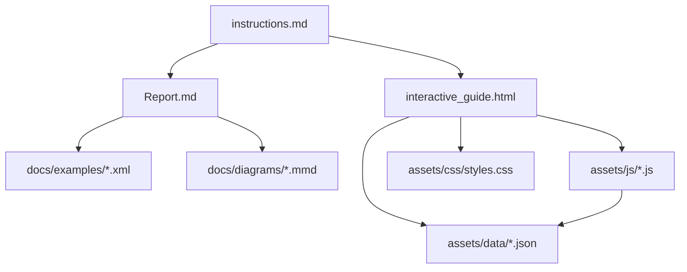
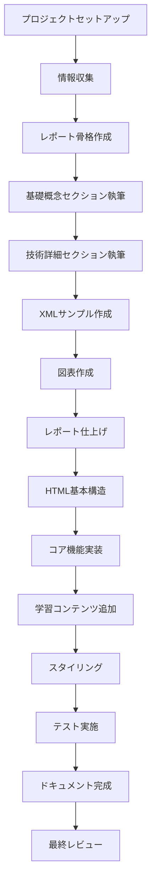

# 環境情報のサプライチェーンデータ連携に関する調査・教育コンテンツ生成指示書

## プロジェクト概要

このプロジェクトの目的は、サプライチェーン全体における環境情報のデータ連携に関する包括的な調査レポートと、教育的なインタラクティブHTMLコンテンツを作成することです。

### 研究テーマ
「BOM/BOPを基盤とした環境情報のサプライチェーンデータ連携：ILCD形式によるLCA分析とISO/IEC 82474との関係性」

---

## 1. 調査の範囲と目標

### 1.1 主要な調査対象

1. **BOM（Bill of Materials）とBOP（Bill of Process）**
   - 製品構成情報の標準化
   - サプライチェーンにおける役割
   - LCAデータソースとしての活用

2. **ILCD（International Reference Life Cycle Data System）形式**
   - 欧州委員会が開発したLCAデータ交換標準
   - XML構造とデータモデル
   - ISO 14040/14044との準拠関係
   - 主要なデータセットタイプ（8種類）

3. **LCA（Life Cycle Assessment）ツール**
   - ILCD形式のデータインポート機能
   - 環境影響評価の手法
   - SimaPro, openLCA, GaBiなどの主要ツール
   - LCI（Life Cycle Inventory）からLCIA（Life Cycle Impact Assessment）への流れ

4. **ISO/IEC 82474（旧IEC 62474）**
   - 材料宣言の国際標準
   - XMLベースのデータ交換フォーマット
   - 宣言可能物質リスト（DSL: Declarable Substance List）
   - RoHS、REACH等の規制との関係

### 1.2 調査の焦点

- サプライチェーン全体でのデータフロー
- 各標準・フォーマット間の相互運用性
- データ変換とマッピングの課題
- 実装事例とベストプラクティス
- 技術的制約と解決策

---

## 2. 成果物の要件

### 2.1 調査レポート（Report.md）

#### 構成要件
以下の構造に従って、包括的なマークダウンレポートを作成してください：

```markdown
# 環境情報のサプライチェーンデータ連携調査レポート

## エグゼクティブサマリー
- 研究背景と目的
- 主要な発見事項
- 提言

## 1. はじめに
### 1.1 背景
### 1.2 研究の目的
### 1.3 研究の範囲

## 2. 基礎概念
### 2.1 サプライチェーンにおける環境情報管理
### 2.2 BOM/BOPの基礎
### 2.3 LCAの基本原則

## 3. 主要標準とフォーマット
### 3.1 ILCD形式
#### 3.1.1 概要と目的
#### 3.1.2 データ構造
#### 3.1.3 8つのデータセットタイプ
#### 3.1.4 ISO 14040/14044との関係
### 3.2 ISO/IEC 82474
#### 3.2.1 標準の目的と適用範囲
#### 3.2.2 XMLスキーマ構造
#### 3.2.3 材料宣言の要件
#### 3.2.4 宣言可能物質リスト（DSL）

## 4. データ連携のフロー
### 4.1 BOM/BOPからのデータ抽出
### 4.2 ISO/IEC 82474による材料宣言
### 4.3 ILCD形式への変換
### 4.4 LCAツールでの分析

## 5. ILCD形式とISO/IEC 82474の関係性
### 5.1 相互補完的な役割
### 5.2 データマッピング
### 5.3 統合の課題
### 5.4 解決策とベストプラクティス

## 6. 実装とツール
### 6.1 主要なLCAツール
### 6.2 データ変換ツール
### 6.3 実装事例

## 7. 課題と解決策
### 7.1 技術的課題
### 7.2 組織的課題
### 7.3 標準化の課題

## 8. 将来の展望
### 8.1 デジタル化とIoT統合
### 8.2 AI/MLの活用可能性
### 8.3 ブロックチェーンとトレーサビリティ

## 9. 結論と提言

## 参考文献

## 付録
### 付録A: ILCD XMLスキーマの例
### 付録B: ISO/IEC 82474 XMLスキーマの例
### 付録C: データマッピング表
```

#### コンテンツ要件
- **根拠に基づいた記述**: すべての主張は、信頼できる情報源（学術論文、公式文書、標準規格など）に基づく
- **技術的正確性**: 標準規格の仕様を正確に記述
- **実用的な視点**: 理論だけでなく、実装上の課題とソリューションも含める
- **図表の活用**: 適切な場所にフローチャートや表を含める（Mermaid記法を使用）
- **具体例**: XML構造の実例を含める

### 2.2 インタラクティブHTML（interactive_guide.html）

#### 目的
学習者が環境情報のサプライチェーンデータ連携について、視覚的かつインタラクティブに理解できる教育コンテンツを作成する。

#### 必須機能

1. **インタラクティブフローチャート**
   - BOM/BOP → ISO/IEC 82474 → ILCD → LCA分析の全体フローを視覚化
   - 各ステップをクリックすると詳細情報が表示される
   - SVGまたはCanvas要素を使用した動的な図

2. **データ形式の比較ツール**
   - ISO/IEC 82474とILCD形式を並べて比較
   - サンプルXMLデータの表示
   - ハイライト機能で重要な要素を強調

3. **シミュレーター**
   - 簡易的なBOMデータ入力機能
   - ILCD形式への変換プロセスの可視化
   - 環境影響の計算例（教育目的の簡易版）

4. **用語集とクイックリファレンス**
   - 重要な用語のポップアップ解説
   - 標準規格の主要ポイントのサマリー

5. **学習モジュール**
   - 段階的な学習コンテンツ（初級・中級・上級）
   - 理解度チェッククイズ
   - インタラクティブな演習問題

#### 技術要件

```html
<!DOCTYPE html>
<html lang="ja">
<head>
    <meta charset="UTF-8">
    <meta name="viewport" content="width=device-width, initial-scale=1.0">
    <title>環境情報サプライチェーンデータ連携 - インタラクティブガイド</title>
    <style>
        /* レスポンシブデザイン */
        /* アクセシビリティに配慮したカラーコントラスト */
        /* モダンで教育的なUIデザイン */
    </style>
</head>
<body>
    <!-- ナビゲーションメニュー -->
    <!-- メインコンテンツエリア -->
    <!-- インタラクティブ要素 -->
    
    <script>
        // バニラJavaScriptを使用（外部ライブラリは最小限）
        // 可能な限りD3.js（CDN経由）を活用して可視化
    </script>
</body>
</html>
```

**推奨ライブラリ（CDN経由）:**
- D3.js（データ可視化）
- Mermaid.js（ダイアグラム）
- Prism.js（シンタックスハイライト）

**デザイン要件:**
- レスポンシブデザイン（モバイル対応）
- WCAG 2.1 AA準拠のアクセシビリティ
- クリーンで直感的なUI/UX
- プリント対応

---

## 3. 調査方法と情報源

### 3.1 推奨情報源

#### 公式ドキュメントと標準規格
1. **ILCD関連**
   - European Commission JRC: ILCD Handbook
   - ILCD Data Network documentation
   - ISO 14040:2006, ISO 14044:2006

2. **ISO/IEC 82474関連**
   - IEC 82474-1:2025（旧IEC 62474）
   - ISO/IEC 82474公式データベース
   - IEC TC 111の文書

3. **LCA関連**
   - PRé Sustainability (SimaPro documentation)
   - GreenDelta (openLCA documentation)
   - Life Cycle Initiative

#### 学術文献
- Google Scholar、Scopus、Web of Scienceでの検索
- キーワード: "ILCD format", "IEC 62474", "supply chain LCA", "BOM environmental data"

#### 業界レポートとホワイトペーパー
- 主要なLCAソフトウェアベンダーの技術文書
- 業界団体（ZVEI, EPEATなど）のガイドライン

### 3.2 調査プロセス

1. **Phase 1: 基礎情報の収集**（1-2日）
   - 各標準規格の公式文書を読み込む
   - 基本概念と用語の整理

2. **Phase 2: 詳細分析**（2-3日）
   - XML構造の詳細分析
   - データマッピングの研究
   - 実装事例の収集

3. **Phase 3: 統合と検証**（1-2日）
   - 情報の統合と整合性チェック
   - 技術的正確性の検証

4. **Phase 4: コンテンツ作成**（3-4日）
   - レポートの執筆
   - HTMLコンテンツの開発

---

## 4. ドキュメントとテストの要件

### 4.1 ドキュメント作成

#### コード内ドキュメント
すべてのJavaScriptコードには、以下を含むコメントを記述：
```javascript
/**
 * 関数の説明
 * @param {type} paramName - パラメータの説明
 * @returns {type} 戻り値の説明
 * @example
 * // 使用例
 */
```

#### 技術文書
以下の追加ドキュメントを作成：

1. **TECHNICAL_NOTES.md**
   - 実装の技術的詳細
   - アーキテクチャ決定の理由
   - 既知の制約と回避策

2. **DATA_SOURCES.md**
   - 使用したすべての情報源のリスト
   - 各情報源の信頼性評価
   - 取得日と引用方法

3. **DEVELOPMENT_LOG.md**
   - 開発プロセスの記録
   - 重要な決定事項
   - 発生した問題と解決方法

### 4.2 テストケース

#### HTMLコンテンツのテスト

**tests/interactive_guide_tests.md** を作成し、以下のテストケースを含める：

```markdown
# インタラクティブガイド テスト仕様

## 機能テスト

### TC-001: ページ読み込み
- **目的**: ページが正常に読み込まれることを確認
- **手順**:
  1. interactive_guide.htmlをブラウザで開く
  2. すべての要素が表示されることを確認
- **期待結果**: エラーなく表示される

### TC-002: インタラクティブフローチャート
- **目的**: フローチャートの各要素がクリック可能で詳細が表示される
- **手順**:
  1. フローチャートの各ノードをクリック
  2. 詳細情報が表示されることを確認
- **期待結果**: 各ノードに対応する詳細情報が表示される

### TC-003: データ形式比較ツール
- **目的**: XML比較機能が正常に動作する
- **手順**:
  1. サンプルXMLを選択
  2. 比較表示が更新されることを確認
- **期待結果**: 選択したXMLが正しく表示され、ハイライトされる

[その他のテストケースを追加]

## パフォーマンステスト

### PT-001: ページ読み込み時間
- **目的**: ページが3秒以内に読み込まれる
- **測定方法**: ブラウザの開発者ツールでNetwork timing測定
- **基準**: First Contentful Paint < 1.5秒、完全読み込み < 3秒

## アクセシビリティテスト

### AT-001: キーボードナビゲーション
- **目的**: すべての機能がキーボードのみで操作可能
- **手順**: Tabキーで全機能を操作
- **期待結果**: フォーカスが適切に移動し、Enterで実行可能

### AT-002: スクリーンリーダー対応
- **目的**: ARIA属性が適切に設定されている
- **ツール**: axe DevTools、WAVE
- **基準**: WCAG 2.1 AA準拠

## ブラウザ互換性テスト

- Chrome（最新版）
- Firefox（最新版）
- Safari（最新版）
- Edge（最新版）

## レスポンシブデザインテスト

- デスクトップ（1920x1080）
- タブレット（768x1024）
- モバイル（375x667）
```

#### レポート品質テスト

**tests/report_quality_checks.md** を作成：

```markdown
# レポート品質チェックリスト

## 構造チェック
- [ ] すべてのセクションが要件通りに含まれている
- [ ] 見出しレベルが適切に階層化されている
- [ ] 目次が正確に生成できる

## コンテンツチェック
- [ ] 各主張に適切な引用がある
- [ ] 技術用語が初出時に定義されている
- [ ] 図表に適切なキャプションがある
- [ ] XMLサンプルが構文的に正しい

## 正確性チェック
- [ ] 標準規格の引用が正確
- [ ] XMLスキーマが公式仕様と一致
- [ ] 技術的記述に誤りがない

## 読みやすさチェック
- [ ] 文章が明瞭で理解しやすい
- [ ] 専門用語と平易な表現のバランスが取れている
- [ ] 論理的な流れがある
```

---

## 5. プロジェクト構成

### 5.1 推奨ディレクトリ構造

```
environmental-supply-chain-lca/
├── README.md                          # プロジェクト概要
├── Report.md                          # 主要調査レポート
├── interactive_guide.html             # インタラクティブHTMLガイド
├── TECHNICAL_NOTES.md                 # 技術文書
├── DATA_SOURCES.md                    # 情報源リスト
├── DEVELOPMENT_LOG.md                 # 開発ログ
├── docs/
│   ├── diagrams/                      # Mermaidダイアグラムのソース
│   │   ├── data_flow.mmd
│   │   ├── xml_structure.mmd
│   │   └── integration_architecture.mmd
│   ├── examples/                      # XMLサンプル
│   │   ├── ilcd_sample.xml
│   │   ├── iso82474_sample.xml
│   │   └── bom_sample.xml
│   └── references/                    # 参考資料
│       ├── standards_summary.md
│       └── terminology.md
├── tests/
│   ├── interactive_guide_tests.md     # HTMLテスト仕様
│   ├── report_quality_checks.md       # レポート品質チェック
│   └── validation_results.md          # 検証結果
└── assets/                            # HTMLで使用する素材
    ├── css/
    │   └── styles.css
    ├── js/
    │   ├── main.js
    │   ├── flowchart.js
    │   ├── simulator.js
    │   └── utils.js
    └── data/
        ├── sample_bom.json
        └── terminology.json
```

### 5.2 ファイル依存関係



---

## 6. 実装ガイドライン

### 6.1 調査レポート作成のステップ

1. **情報収集**
   ```bash
   # 公式ドキュメントの取得
   # - ILCD Handbook PDFのダウンロード
   # - ISO/IEC 82474仕様書の参照
   # - 主要LCAツールのドキュメント確認
   ```

2. **構造の作成**
   - セクション見出しの作成
   - 各セクションの概要文を記述

3. **コンテンツの執筆**
   - 基礎概念から始める
   - 技術的詳細を段階的に追加
   - 実例とケーススタディを含める

4. **図表の作成**
   - Mermaidを使用したフローチャート
   - 表形式のデータマッピング
   - XMLスキーマの視覚化

5. **レビューと修正**
   - 技術的正確性の確認
   - 読みやすさの改善
   - 参考文献の整備

### 6.2 インタラクティブHTML作成のステップ

1. **HTMLの基本構造**
   ```html
   <!DOCTYPE html>
   <html lang="ja">
   <head>
       <!-- メタ情報 -->
       <!-- CSS -->
   </head>
   <body>
       <!-- ヘッダー -->
       <header>
           <nav><!-- ナビゲーション --></nav>
       </header>
       
       <!-- メインコンテンツ -->
       <main>
           <section id="overview"><!-- 概要 --></section>
           <section id="flowchart"><!-- フローチャート --></section>
           <section id="comparison"><!-- 比較ツール --></section>
           <section id="simulator"><!-- シミュレーター --></section>
           <section id="learning"><!-- 学習モジュール --></section>
       </main>
       
       <!-- フッター -->
       <footer><!-- クレジットと参考情報 --></footer>
       
       <!-- JavaScript -->
       <script src="assets/js/main.js"></script>
   </body>
   </html>
   ```

2. **CSSスタイリング**
   - モダンなレイアウト（Flexbox/Grid）
   - レスポンシブデザイン（メディアクエリ）
   - アニメーションとトランジション
   - アクセシビリティに配慮した配色

3. **JavaScript機能実装**
   - モジュール化されたコード構造
   - イベントハンドリング
   - データバインディング
   - エラーハンドリング

4. **データ準備**
   - サンプルBOMデータ（JSON）
   - XMLサンプル（文字列またはファイル）
   - 用語集データ（JSON）

5. **テストとデバッグ**
   - ブラウザ互換性テスト
   - パフォーマンス測定
   - アクセシビリティ監査

---

## 7. 品質基準

### 7.1 レポートの品質基準

- **技術的正確性**: 95%以上（専門家レビューで確認）
- **網羅性**: すべての必須トピックをカバー
- **可読性**: Flesch Reading Ease Score > 40（日本語の場合は適切に調整）
- **引用の適切性**: すべての主張に適切な出典

### 7.2 HTMLコンテンツの品質基準

- **アクセシビリティ**: WCAG 2.1 AA準拠（axe DevToolsで0エラー）
- **パフォーマンス**: Lighthouse Score > 90
- **ブラウザ互換性**: 主要4ブラウザで正常動作
- **レスポンシブ**: 3種類のデバイスサイズで適切表示

---

## 8. Claude Codeへの実行指示

### 8.1 初期セットアップ

```bash
# プロジェクトディレクトリの作成
mkdir -p environmental-supply-chain-lca/{docs/{diagrams,examples,references},tests,assets/{css,js,data}}
cd environmental-supply-chain-lca

# READMEの作成
cat > README.md << 'EOF'
# 環境情報のサプライチェーンデータ連携プロジェクト

## 概要
このプロジェクトは、BOM/BOPからILCD形式を経由したLCA分析、
およびISO/IEC 82474との関係性について調査し、
教育的なコンテンツを提供します。

## 成果物
- 包括的な調査レポート（Report.md）
- インタラクティブHTMLガイド（interactive_guide.html）
- 技術文書とテストケース

## 構成
詳細はinstructions.mdを参照してください。
EOF
```

### 8.2 実行手順

#### Step 1: 情報収集と分析（推定時間: 4-6時間）

```bash
# Web検索を実施
# - "ILCD format specification"
# - "ISO IEC 82474 material declaration"
# - "BOM BOP supply chain LCA"
# - "ILCD openLCA SimaPro data exchange"
# - "IEC 62474 XML schema examples"
```

**実施事項:**
1. 公式ドキュメントのレビュー
2. 技術仕様の詳細分析
3. 実装事例の収集
4. DATA_SOURCES.mdへの記録

#### Step 2: 調査レポートの執筆（推定時間: 8-12時間）

```bash
# Report.mdの作成
# 各セクションを順次執筆
```

**重点事項:**
- エグゼクティブサマリーは最後に書く
- 各セクションで技術的正確性を維持
- 適切な図表を含める
- XML例を検証済みのものを使用

**チェックポイント:**
- [ ] 構造が要件通りか
- [ ] すべてのセクションが完成しているか
- [ ] 引用が適切か
- [ ] 図表が効果的か

#### Step 3: XMLサンプルの作成（推定時間: 2-3時間）

```bash
# docs/examples/に以下を作成
# - ilcd_sample.xml
# - iso82474_sample.xml
# - bom_sample.xml
```

**要件:**
- 構文的に正しいXML
- 実際の仕様に基づく構造
- コメントで主要要素を説明
- 小規模で理解しやすい例

#### Step 4: Mermaidダイアグラムの作成（推定時間: 2-4時間）

```bash
# docs/diagrams/に以下を作成
# - data_flow.mmd: 全体のデータフロー
# - xml_structure.mmd: XML構造の比較
# - integration_architecture.mmd: システム統合アーキテクチャ
```

#### Step 5: インタラクティブHTMLの開発（推定時間: 12-16時間）

**5.1 基本構造の作成**
```bash
# interactive_guide.htmlの基本骨格
# assets/css/styles.cssの作成
# assets/js/main.jsの作成
```

**5.2 コア機能の実装**
- インタラクティブフローチャート
- データ形式比較ツール
- シミュレーター

**5.3 学習コンテンツの追加**
- 用語集
- クイズ機能
- 段階的チュートリアル

**5.4 スタイリングと仕上げ**
- レスポンシブデザイン
- アニメーション
- アクセシビリティ対応

#### Step 6: テストとドキュメント（推定時間: 4-6時間）

```bash
# tests/interactive_guide_tests.mdの作成と実施
# tests/report_quality_checks.mdの作成と実施
# TECHNICAL_NOTES.mdの執筆
# DEVELOPMENT_LOG.mdの執筆
```

**検証項目:**
- すべてのテストケースを実行
- 品質基準を満たしているか確認
- ドキュメントが完全か確認

#### Step 7: 最終レビューと調整（推定時間: 2-4時間）

- 全体の一貫性チェック
- クロスリファレンスの確認
- タイポや文法エラーの修正
- 最終テスト

### 8.3 推奨作業順序



---

## 9. 追加の考慮事項

### 9.1 言語とローカライゼーション

- 主要コンテンツは日本語で作成
- 技術用語は英語を併記
- HTMLには多言語対応の構造を準備（将来の拡張用）

### 9.2 保守性と拡張性

- コードはモジュール化し、再利用可能に
- 設定をJSON化して柔軟に変更可能に
- ドキュメントは将来の更新を想定した構造に

### 9.3 セキュリティとプライバシー

- ユーザーデータの収集は行わない
- 外部リソースの読み込みは最小限に
- CDNの使用は信頼できるソースのみ

### 9.4 ライセンスと著作権

- すべての引用元を明記
- 使用する標準規格の引用ガイドラインに従う
- オープンソースライブラリのライセンスを遵守

---

## 10. 成功基準

このプロジェクトは、以下の基準をすべて満たす場合に成功とみなされます：

### 10.1 調査レポート
- [ ] すべての必須セクションが完成
- [ ] 技術的に正確で検証可能
- [ ] 適切な引用と参考文献
- [ ] 効果的な図表を含む
- [ ] 読みやすく理解しやすい

### 10.2 インタラクティブHTML
- [ ] すべての必須機能が実装されている
- [ ] 主要ブラウザで正常に動作
- [ ] WCAG 2.1 AA準拠
- [ ] パフォーマンス基準を満たす
- [ ] 教育的に効果的

### 10.3 ドキュメントとテスト
- [ ] 完全なテストケースが存在
- [ ] すべてのテストが合格
- [ ] 技術文書が完備
- [ ] 開発ログが詳細

### 10.4 全体
- [ ] プロジェクト構造が要件通り
- [ ] すべてのファイルが適切に配置
- [ ] READMEが明確で有用
- [ ] 第三者が理解・使用可能

---

## 11. 参考情報とリソース

### 11.1 主要標準規格

1. **ISO 14040:2006** - Environmental management — Life cycle assessment — Principles and framework
2. **ISO 14044:2006** - Environmental management — Life cycle assessment — Requirements and guidelines
3. **IEC 82474-1:2025** - Material declaration — Part 1: General requirements
4. **ISO/TS 14048:2002** - Environmental management — Life cycle assessment — Data documentation format

### 11.2 重要なウェブサイト

- ILCD Data Network: https://eplca.jrc.ec.europa.eu/
- IEC 62474 Database: http://std.iec.ch/iec62474
- Life Cycle Initiative: https://www.lifecycleinitiative.org/
- openLCA: https://www.openlca.org/
- PRé Sustainability: https://pre-sustainability.com/

### 11.3 推奨ツール

- **テキストエディタ**: VS Code（Markdownプレビュー機能付き）
- **XMLバリデータ**: xmllint, Online XML validators
- **アクセシビリティチェック**: axe DevTools, WAVE
- **パフォーマンステスト**: Lighthouse, WebPageTest
- **図表作成**: Mermaid Live Editor

---

## 12. トラブルシューティング

### 12.1 よくある問題と解決策

**問題**: 標準規格の公式文書へのアクセスが限定的
**解決策**: 
- 無料で入手可能な文書から始める
- 学術論文や技術記事を活用
- 公式サイトのサマリーやプレゼンテーション資料を参照

**問題**: XMLサンプルが複雑すぎる
**解決策**:
- 最小限の要素から始める
- 段階的に複雑さを追加
- コメントで各要素を説明

**問題**: HTMLのブラウザ互換性の問題
**解決策**:
- Can I Useでブラウザサポートを確認
- ポリフィルを使用
- フォールバック機能を実装

**問題**: パフォーマンスの問題
**解決策**:
- 画像とアセットの最適化
- 遅延読み込みの実装
- 不要な依存関係の削除

---

## 13. フィードバックと改善

プロジェクト完成後、以下を実施：

1. **自己評価**
   - 成功基準との照合
   - 改善点の特定

2. **ピアレビュー**（可能であれば）
   - 技術的正確性の検証
   - ユーザビリティテスト

3. **改善計画**
   - 優先順位付き改善リスト
   - 将来のバージョンのロードマップ

---

## 14. 付録

### 14.1 用語集

- **BOM (Bill of Materials)**: 製品を構成する部品や材料のリスト
- **BOP (Bill of Process)**: 製造プロセスの手順書
- **ILCD**: International Reference Life Cycle Data System
- **LCA**: Life Cycle Assessment（ライフサイクルアセスメント）
- **LCI**: Life Cycle Inventory（ライフサイクルインベントリ）
- **LCIA**: Life Cycle Impact Assessment（ライフサイクル影響評価）
- **DSL**: Declarable Substance List（宣言可能物質リスト）
- **PCR**: Product Category Rules
- **EPD**: Environmental Product Declaration

### 14.2 略語リスト

- **EU**: European Union
- **JRC**: Joint Research Centre
- **IEC**: International Electrotechnical Commission
- **ISO**: International Organization for Standardization
- **RoHS**: Restriction of Hazardous Substances
- **REACH**: Registration, Evaluation, Authorization and Restriction of Chemicals
- **WCAG**: Web Content Accessibility Guidelines
- **ARIA**: Accessible Rich Internet Applications

---

## 結論

この指示書に従うことで、環境情報のサプライチェーンデータ連携に関する包括的で教育的なコンテンツセットを作成できます。技術的正確性、実用性、教育的価値のバランスを保ちながら、高品質な成果物を目指してください。

**推定総作業時間**: 40-60時間
**推奨期間**: 2-3週間

すべての要件を満たし、品質基準を達成することで、この分野における貴重なリソースを提供できるでしょう。

---

## 変更履歴

- Version 1.0 (2025-10-25): 初版作成
